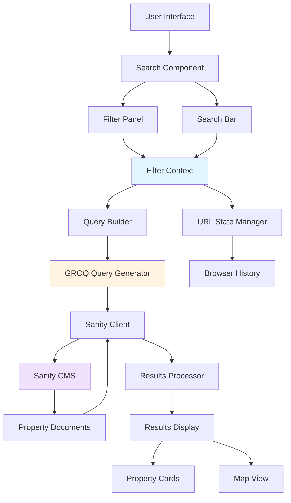

# Feature 1: Advanced Search & Filtering System

## Overview

**Priority:** High  
**Estimated Effort:** 21 Story Points  
**Duration:** 3 weeks  
**Dependencies:** None

### Description

Implement a comprehensive search and filtering system that allows users to find properties based on multiple criteria including location, price range, dates, property type, number of guests, amenities, and more. The system will provide real-time results with smooth UX and maintain filter state across navigation.

### Business Value

- **Reduces time-to-booking by 40%** - Users find relevant properties faster
- **Increases user satisfaction** - Better match between user needs and results
- **Reduces bounce rate** - Users stay engaged when they can filter effectively
- **Competitive parity** - Matches features offered by major competitors

---

## Architecture Diagram



---

## User Stories & Acceptance Criteria

### Story 1: Basic Text Search
**As a** user  
**I want to** search for properties by location name  
**So that** I can find properties in my desired destination

**Acceptance Criteria:**
- Search bar accepts text input for location
- Search triggers on Enter key or button click
- Results update within 2 seconds
- Search term is highlighted in results
- Empty search shows all properties
- Invalid locations show helpful error message

**Estimate:** 3 Story Points

---

### Story 2: Price Range Filter
**As a** user  
**I want to** filter properties by price range  
**So that** I only see properties within my budget

**Acceptance Criteria:**
- Dual-handle slider for min/max price
- Price range displays current values
- Results update in real-time as slider moves
- Price range persists when navigating away and back
- Shows count of properties in current range
- Handles edge cases (no properties in range)

**Estimate:** 3 Story Points

---

### Story 3: Date Range & Availability Filter
**As a** user  
**I want to** filter by check-in and check-out dates  
**So that** I only see available properties for my travel dates

**Acceptance Criteria:**
- Date picker with calendar interface
- Prevents selecting past dates
- Check-out must be after check-in
- Shows availability status for each property
- Calculates total nights and displays price
- Integrates with booking calendar data

**Estimate:** 5 Story Points

---

### Story 4: Property Type & Amenities Filter
**As a** user  
**I want to** filter by property type and amenities  
**So that** I find properties that meet my specific needs

**Acceptance Criteria:**
- Checkbox groups for property types (apartment, house, villa, etc.)
- Checkbox groups for amenities (WiFi, pool, parking, etc.)
- Multi-select capability
- Shows count of properties matching each filter
- Filters are collapsible/expandable
- "Clear all" option for each filter group

**Estimate:** 3 Story Points

---

### Story 5: Guest Capacity Filter
**As a** user  
**I want to** filter by number of guests, bedrooms, and bathrooms  
**So that** I find properties that accommodate my group size

**Acceptance Criteria:**
- Increment/decrement controls for guests
- Separate controls for adults and children
- Bedroom and bathroom count filters
- Results only show properties meeting minimum requirements
- Clear visual feedback on selected values
- Handles properties with flexible guest counts

**Estimate:** 2 Story Points

---

### Story 6: Filter State Persistence
**As a** user  
**I want to** have my filters saved in the URL  
**So that** I can share searches and use browser back/forward

**Acceptance Criteria:**
- All filter values encoded in URL query parameters
- URL updates without page reload
- Shareable URLs maintain all filter state
- Browser back/forward works correctly
- Bookmarked searches work on return
- Invalid URL parameters handled gracefully

**Estimate:** 3 Story Points

---

### Story 7: Results Sorting & Display
**As a** user  
**I want to** sort search results by different criteria  
**So that** I can prioritize properties based on my preferences

**Acceptance Criteria:**
- Sort options: Price (low/high), Rating, Newest
- Sort selection persists with filters
- Results count displayed prominently
- Loading states during search
- Empty state with helpful suggestions
- Pagination or infinite scroll for large result sets

**Estimate:** 2 Story Points

---

## Technical Specifications

### Component Structure

```
components/
├── search/
│   ├── SearchBar.tsx
│   ├── FilterPanel.tsx
│   ├── filters/
│   │   ├── PriceRangeFilter.tsx
│   │   ├── DateRangeFilter.tsx
│   │   ├── PropertyTypeFilter.tsx
│   │   ├── AmenitiesFilter.tsx
│   │   └── GuestCapacityFilter.tsx
│   ├── SearchResults.tsx
│   └── SortControls.tsx
├── context/
│   └── SearchContext.tsx
└── hooks/
    ├── useSearch.ts
    ├── useFilters.ts
    └── useUrlState.ts
```

### Search Context API

```typescript
interface SearchFilters {
  location: string;
  priceRange: { min: number; max: number };
  dateRange: { checkIn: Date | null; checkOut: Date | null };
  propertyTypes: string[];
  amenities: string[];
  guests: { adults: number; children: number };
  bedrooms: number;
  bathrooms: number;
}

interface SearchContextValue {
  filters: SearchFilters;
  updateFilter: (key: keyof SearchFilters, value: any) => void;
  clearFilters: () => void;
  results: Property[];
  isLoading: boolean;
  error: string | null;
  sortBy: SortOption;
  setSortBy: (option: SortOption) => void;
}
```

### GROQ Query Example

```groq
*[_type == "property" 
  && location match $location
  && price >= $minPrice 
  && price <= $maxPrice
  && guests >= $guestCount
  && bedrooms >= $bedroomCount
  && bathrooms >= $bathroomCount
  && propertyType in $propertyTypes
  && count((amenities[]->slug.current)[@ in $amenities]) == count($amenities)
] | order($sortField $sortDirection) [0...50] {
  _id,
  title,
  slug,
  price,
  location,
  propertyType,
  bedrooms,
  bathrooms,
  guests,
  mainImage,
  rating,
  amenities[]-> {
    title,
    slug
  }
}
```

### URL State Format

```
/search?
  location=paris
  &priceMin=100
  &priceMax=500
  &checkIn=2024-06-01
  &checkOut=2024-06-07
  &guests=4
  &bedrooms=2
  &types=apartment,house
  &amenities=wifi,pool
  &sort=price-asc
```

---

## Sanity Schema Updates

### Property Schema Additions

```javascript
{
  name: 'property',
  type: 'document',
  fields: [
    // ... existing fields
    {
      name: 'availability',
      title: 'Availability Calendar',
      type: 'array',
      of: [{
        type: 'object',
        fields: [
          { name: 'date', type: 'date' },
          { name: 'available', type: 'boolean' },
          { name: 'price', type: 'number' }
        ]
      }]
    },
    {
      name: 'instantBook',
      title: 'Instant Book Available',
      type: 'boolean'
    },
    {
      name: 'minimumStay',
      title: 'Minimum Stay (nights)',
      type: 'number'
    }
  ]
}
```

---

## Testing Strategy

### Unit Tests
- Filter component logic
- Query builder functions
- URL state encoding/decoding
- Date validation logic

### Integration Tests
- Filter combinations produce correct queries
- URL state syncs with filter state
- Results update when filters change
- Sort options work with filters

### E2E Tests
- Complete search flow from input to results
- Filter persistence across navigation
- Shareable URL functionality
- Mobile responsive behavior

### Performance Tests
- Search response time < 2 seconds
- Filter updates < 500ms
- Handle 1000+ properties efficiently
- Debounce rapid filter changes

---

## Performance Considerations

1. **Debouncing:** Text input and slider changes debounced by 300ms
2. **Query Optimization:** Indexed fields in Sanity for common filters
3. **Caching:** Cache search results for 5 minutes
4. **Lazy Loading:** Load filter options on demand
5. **Virtual Scrolling:** For large result sets (100+ properties)

---

## Accessibility Requirements

- Keyboard navigation for all filters
- ARIA labels for screen readers
- Focus management in filter panels
- Color contrast ratios meet WCAG AA
- Error messages announced to screen readers
- Mobile touch targets minimum 44x44px

---

## Rollout Plan

### Phase 1: MVP (Week 1)
- Basic text search
- Price range filter
- Property type filter
- Simple results display

### Phase 2: Enhanced Filters (Week 2)
- Date range picker
- Amenities filter
- Guest capacity filter
- Sort controls

### Phase 3: Polish & Optimization (Week 3)
- URL state persistence
- Performance optimization
- Accessibility audit
- Mobile optimization
- User testing and refinements

---

## Success Metrics

### Primary Metrics
- **Search usage rate:** 80% of users use search/filters
- **Time to first booking:** Reduced by 40%
- **Filter engagement:** Average 3+ filters used per search

### Secondary Metrics
- **Search abandonment rate:** < 30%
- **Results click-through rate:** > 60%
- **Shared search URLs:** Track usage of shareable links

### Technical Metrics
- **Search response time:** < 2 seconds (95th percentile)
- **Filter update time:** < 500ms
- **Error rate:** < 1%

---

## Dependencies & Risks

### Dependencies
- Sanity CMS availability and performance
- Property data completeness (all fields populated)
- Date/calendar library (react-day-picker or similar)

### Risks
- **Performance:** Large datasets may slow queries
  - *Mitigation:* Implement pagination and query optimization
- **Data Quality:** Incomplete property data affects filter accuracy
  - *Mitigation:* Data validation and cleanup sprint
- **UX Complexity:** Too many filters may overwhelm users
  - *Mitigation:* User testing and progressive disclosure

---

## Future Enhancements

- Map-based search with boundary filtering
- Saved searches and alerts
- Voice search capability
- AI-powered natural language search
- Advanced filters (pet-friendly, accessibility features)
- Search analytics dashboard for property owners
