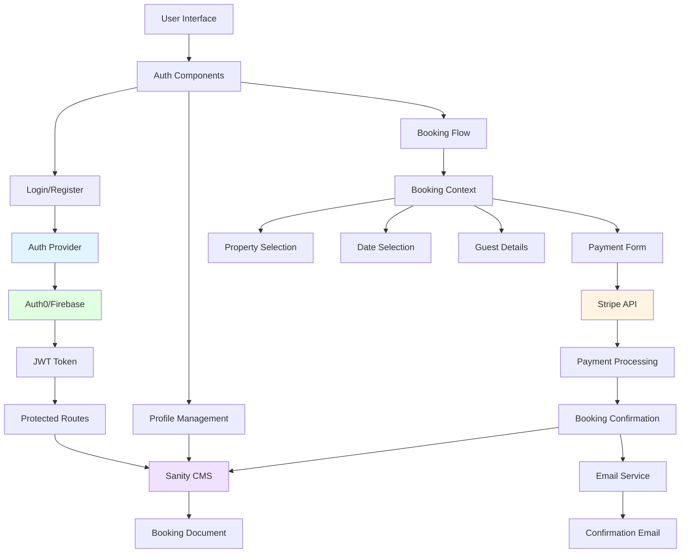

# Feature 2: User Authentication & Booking System

## Overview

**Priority:** Critical  
**Estimated Effort:** 34 Story Points  
**Duration:** 5 weeks  
**Dependencies:** None (Foundation for other features)

### Description

Implement a complete user authentication system with profile management and an integrated booking flow. This includes user registration, login, profile management, booking creation, payment processing, booking confirmation, and booking history. This is the foundation for personalization and revenue generation.

### Business Value

- **Enables direct revenue generation** - Core booking functionality
- **Creates user retention** - Profiles encourage repeat visits
- **Provides personalization data** - User preferences and history
- **Builds trust** - Secure authentication and payment processing
- **Competitive necessity** - Essential for any booking platform

---

## Architecture Diagram



---

## User Stories & Acceptance Criteria

### Story 1: User Registration
**As a** new user  
**I want to** create an account  
**So that** I can book properties and manage my reservations

**Acceptance Criteria:**
- Registration form with email, password, name
- Email validation and uniqueness check
- Password strength requirements (8+ chars, uppercase, number)
- Email verification flow
- Social login options (Google, Facebook)
- Terms of service acceptance
- Automatic login after registration
- Error handling for duplicate accounts

**Estimate:** 5 Story Points

---

### Story 2: User Login & Session Management
**As a** registered user  
**I want to** log in to my account  
**So that** I can access my bookings and profile

**Acceptance Criteria:**
- Login form with email and password
- "Remember me" option
- Session persistence across browser sessions
- Automatic token refresh
- Logout functionality
- "Forgot password" flow
- Account lockout after failed attempts
- Redirect to intended page after login

**Estimate:** 3 Story Points

---

### Story 3: User Profile Management
**As a** logged-in user  
**I want to** view and edit my profile  
**So that** I can keep my information up to date

**Acceptance Criteria:**
- Profile page with user information
- Edit mode for name, email, phone, photo
- Password change functionality
- Email change requires verification
- Profile photo upload and crop
- Notification preferences
- Account deletion option
- Save confirmation and error handling

**Estimate:** 5 Story Points

---

### Story 4: Booking Flow - Property & Dates
**As a** logged-in user  
**I want to** select a property and dates  
**So that** I can start the booking process

**Acceptance Criteria:**
- "Book Now" button on property details
- Date picker with availability calendar
- Blocked dates shown clearly
- Minimum stay requirements enforced
- Price calculation for selected dates
- Guest count selection
- Special requests text field
- Booking summary sidebar
- Login prompt for non-authenticated users

**Estimate:** 5 Story Points

---

### Story 5: Booking Flow - Guest Details
**As a** user making a booking  
**I want to** provide guest information  
**So that** the host knows who is staying

**Acceptance Criteria:**
- Guest details form (names, contact info)
- Pre-filled with profile data
- Additional guest fields if group booking
- Purpose of trip selection
- Estimated arrival time
- Special requirements field
- Form validation
- Save guest info for future bookings

**Estimate:** 3 Story Points

---

### Story 6: Payment Processing
**As a** user completing a booking  
**I want to** securely pay for my reservation  
**So that** I can confirm my booking

**Acceptance Criteria:**
- Stripe payment form integration
- Credit/debit card support
- Payment amount breakdown (nights, fees, taxes)
- Secure card data handling (PCI compliant)
- Payment error handling
- Loading states during processing
- Payment confirmation screen
- Receipt generation
- Refund policy display

**Estimate:** 8 Story Points

---

### Story 7: Booking Confirmation & Management
**As a** user who completed a booking  
**I want to** receive confirmation and manage my booking  
**So that** I have all necessary information

**Acceptance Criteria:**
- Confirmation page with booking details
- Confirmation email sent immediately
- Booking reference number
- Calendar invite attachment
- Host contact information
- Cancellation policy displayed
- "My Bookings" page listing all reservations
- Booking details view
- Cancellation option (if policy allows)
- Booking status tracking

**Estimate:** 5 Story Points

---

## Technical Specifications

### Component Structure

```
components/
├── auth/
│   ├── LoginForm.tsx
│   ├── RegisterForm.tsx
│   ├── ForgotPasswordForm.tsx
│   ├── SocialLoginButtons.tsx
│   └── ProtectedRoute.tsx
├── profile/
│   ├── ProfileView.tsx
│   ├── ProfileEdit.tsx
│   ├── ProfilePhoto.tsx
│   └── NotificationSettings.tsx
├── booking/
│   ├── BookingFlow.tsx
│   ├── DateSelection.tsx
│   ├── GuestDetails.tsx
│   ├── PaymentForm.tsx
│   ├── BookingSummary.tsx
│   ├── BookingConfirmation.tsx
│   └── BookingList.tsx
├── context/
│   ├── AuthContext.tsx
│   └── BookingContext.tsx
└── hooks/
    ├── useAuth.ts
    ├── useBooking.ts
    └── usePayment.ts
```

### Auth Context API

```typescript
interface User {
  id: string;
  email: string;
  name: string;
  photoUrl?: string;
  phone?: string;
  emailVerified: boolean;
  createdAt: Date;
}

interface AuthContextValue {
  user: User | null;
  isAuthenticated: boolean;
  isLoading: boolean;
  login: (email: string, password: string) => Promise<void>;
  register: (email: string, password: string, name: string) => Promise<void>;
  logout: () => Promise<void>;
  updateProfile: (data: Partial<User>) => Promise<void>;
  resetPassword: (email: string) => Promise<void>;
  socialLogin: (provider: 'google' | 'facebook') => Promise<void>;
}
```

### Booking Context API

```typescript
interface Booking {
  id: string;
  propertyId: string;
  userId: string;
  checkIn: Date;
  checkOut: Date;
  guests: {
    adults: number;
    children: number;
  };
  guestDetails: {
    name: string;
    email: string;
    phone: string;
  };
  totalPrice: number;
  status: 'pending' | 'confirmed' | 'cancelled' | 'completed';
  paymentId: string;
  specialRequests?: string;
  createdAt: Date;
}

interface BookingContextValue {
  currentBooking: Partial<Booking> | null;
  bookings: Booking[];
  isProcessing: boolean;
  startBooking: (propertyId: string) => void;
  updateBookingDates: (checkIn: Date, checkOut: Date) => void;
  updateGuestDetails: (details: any) => void;
  processPayment: (paymentMethod: string) => Promise<void>;
  confirmBooking: () => Promise<Booking>;
  cancelBooking: (bookingId: string) => Promise<void>;
  fetchUserBookings: () => Promise<void>;
}
```

### Sanity Schema - User Document

```javascript
{
  name: 'user',
  title: 'User',
  type: 'document',
  fields: [
    {
      name: 'authId',
      title: 'Auth Provider ID',
      type: 'string',
      validation: Rule => Rule.required()
    },
    {
      name: 'email',
      title: 'Email',
      type: 'string',
      validation: Rule => Rule.required().email()
    },
    {
      name: 'name',
      title: 'Full Name',
      type: 'string',
      validation: Rule => Rule.required()
    },
    {
      name: 'phone',
      title: 'Phone Number',
      type: 'string'
    },
    {
      name: 'photo',
      title: 'Profile Photo',
      type: 'image'
    },
    {
      name: 'emailVerified',
      title: 'Email Verified',
      type: 'boolean',
      initialValue: false
    },
    {
      name: 'preferences',
      title: 'User Preferences',
      type: 'object',
      fields: [
        { name: 'newsletter', type: 'boolean' },
        { name: 'bookingReminders', type: 'boolean' },
        { name: 'promotions', type: 'boolean' }
      ]
    }
  ]
}
```

### Sanity Schema - Booking Document

```javascript
{
  name: 'booking',
  title: 'Booking',
  type: 'document',
  fields: [
    {
      name: 'bookingReference',
      title: 'Booking Reference',
      type: 'string',
      validation: Rule => Rule.required()
    },
    {
      name: 'property',
      title: 'Property',
      type: 'reference',
      to: [{ type: 'property' }],
      validation: Rule => Rule.required()
    },
    {
      name: 'user',
      title: 'User',
      type: 'reference',
      to: [{ type: 'user' }],
      validation: Rule => Rule.required()
    },
    {
      name: 'checkIn',
      title: 'Check-in Date',
      type: 'date',
      validation: Rule => Rule.required()
    },
    {
      name: 'checkOut',
      title: 'Check-out Date',
      type: 'date',
      validation: Rule => Rule.required()
    },
    {
      name: 'guests',
      title: 'Number of Guests',
      type: 'object',
      fields: [
        { name: 'adults', type: 'number' },
        { name: 'children', type: 'number' }
      ]
    },
    {
      name: 'guestDetails',
      title: 'Guest Details',
      type: 'object',
      fields: [
        { name: 'name', type: 'string' },
        { name: 'email', type: 'string' },
        { name: 'phone', type: 'string' }
      ]
    },
    {
      name: 'pricing',
      title: 'Pricing Breakdown',
      type: 'object',
      fields: [
        { name: 'nightlyRate', type: 'number' },
        { name: 'nights', type: 'number' },
        { name: 'subtotal', type: 'number' },
        { name: 'serviceFee', type: 'number' },
        { name: 'taxes', type: 'number' },
        { name: 'total', type: 'number' }
      ]
    },
    {
      name: 'status',
      title: 'Booking Status',
      type: 'string',
      options: {
        list: [
          { title: 'Pending', value: 'pending' },
          { title: 'Confirmed', value: 'confirmed' },
          { title: 'Cancelled', value: 'cancelled' },
          { title: 'Completed', value: 'completed' }
        ]
      }
    },
    {
      name: 'paymentId',
      title: 'Payment ID',
      type: 'string'
    },
    {
      name: 'specialRequests',
      title: 'Special Requests',
      type: 'text'
    }
  ]
}
```

### Stripe Integration

```typescript
// Payment processing
import { loadStripe } from '@stripe/stripe-js';
import { Elements, CardElement, useStripe, useElements } from '@stripe/react-stripe-js';

const stripePromise = loadStripe(process.env.NEXT_PUBLIC_STRIPE_KEY);

// API route for payment intent
// pages/api/create-payment-intent.ts
export default async function handler(req, res) {
  const { amount, bookingId } = req.body;
  
  const paymentIntent = await stripe.paymentIntents.create({
    amount: amount * 100, // Convert to cents
    currency: 'usd',
    metadata: { bookingId }
  });
  
  res.json({ clientSecret: paymentIntent.client_secret });
}
```

---

## Testing Strategy

### Unit Tests
- Auth context state management
- Form validation logic
- Price calculation functions
- Date validation and availability checks
- Booking reference generation

### Integration Tests
- Complete registration flow
- Login and session persistence
- Profile update with API calls
- Booking creation end-to-end
- Payment processing (test mode)
- Email sending verification

### E2E Tests
- User registration to first booking
- Login, browse, book, confirm flow
- Profile management workflows
- Booking cancellation flow
- Password reset flow
- Social login integration

### Security Tests
- SQL injection prevention
- XSS attack prevention
- CSRF token validation
- JWT token expiration
- Password hashing verification
- PCI compliance for payment data

---

## Security Considerations

1. **Authentication:**
   - JWT tokens with short expiration (15 min access, 7 day refresh)
   - Secure HTTP-only cookies for tokens
   - Rate limiting on auth endpoints

2. **Payment Security:**
   - Never store card details
   - Use Stripe Elements for PCI compliance
   - Server-side payment verification
   - Webhook signature validation

3. **Data Protection:**
   - Encrypt sensitive user data
   - GDPR compliance for EU users
   - Data retention policies
   - Secure password reset tokens

4. **API Security:**
   - API route authentication middleware
   - Input validation and sanitization
   - CORS configuration
   - Request rate limiting

---

## Performance Considerations

1. **Auth State:** Cache user data in memory, refresh on token renewal
2. **Booking List:** Paginate user bookings (10 per page)
3. **Payment Processing:** Show loading states, prevent double submission
4. **Profile Photos:** Optimize and resize on upload
5. **Session Management:** Efficient token refresh strategy

---

## Accessibility Requirements

- Keyboard navigation for all forms
- ARIA labels for form fields
- Error messages announced to screen readers
- Focus management in multi-step booking flow
- High contrast mode support
- Screen reader friendly payment form

---

## Rollout Plan

### Phase 1: Authentication (Week 1-2)
- User registration and login
- Session management
- Protected routes
- Basic profile view

### Phase 2: Profile Management (Week 2-3)
- Profile editing
- Photo upload
- Password change
- Notification preferences

### Phase 3: Booking Flow (Week 3-4)
- Property selection and dates
- Guest details form
- Booking summary
- Basic booking creation

### Phase 4: Payment & Confirmation (Week 4-5)
- Stripe integration
- Payment processing
- Booking confirmation
- Email notifications
- Booking management

### Phase 5: Testing & Polish (Week 5)
- Security audit
- Performance optimization
- User acceptance testing
- Bug fixes and refinements

---

## Success Metrics

### Primary Metrics
- **Registration conversion:** 30% of visitors create accounts
- **Booking completion rate:** 70% of started bookings complete
- **Payment success rate:** 95%+ successful transactions

### Secondary Metrics
- **Login frequency:** Average 2+ logins per week for active users
- **Profile completion:** 80% of users complete full profile
- **Booking abandonment:** < 30% at payment stage

### Technical Metrics
- **Auth response time:** < 1 second
- **Payment processing time:** < 3 seconds
- **Session uptime:** 99.9%
- **Security incidents:** 0 breaches

---

## Dependencies & Risks

### Dependencies
- Auth0 or Firebase Authentication service
- Stripe payment gateway account
- Email service (SendGrid, AWS SES)
- SSL certificate for secure connections

### Risks
- **Payment Integration Complexity:** Stripe setup and testing
  - *Mitigation:* Dedicated sprint for payment integration, extensive testing
- **Security Vulnerabilities:** Auth systems are high-value targets
  - *Mitigation:* Security audit, penetration testing, regular updates
- **User Data Privacy:** GDPR and privacy law compliance
  - *Mitigation:* Legal review, privacy policy, data handling procedures
- **Email Deliverability:** Confirmation emails may go to spam
  - *Mitigation:* SPF/DKIM setup, reputable email service, testing

---

## Third-Party Services

### Auth0 (Recommended)
- **Cost:** $0-$228/month (based on active users)
- **Features:** Social login, MFA, user management
- **Integration:** React SDK available

### Stripe
- **Cost:** 2.9% + $0.30 per transaction
- **Features:** Payment processing, refunds, webhooks
- **Integration:** React Stripe.js library

### SendGrid
- **Cost:** $0-$15/month (up to 40k emails)
- **Features:** Transactional emails, templates
- **Integration:** Node.js SDK

---

## Future Enhancements

- Two-factor authentication (2FA)
- Biometric login (fingerprint, face ID)
- Guest checkout (book without account)
- Saved payment methods
- Booking modifications (date changes)
- Host dashboard for managing bookings
- Review and rating system
- Loyalty program integration
- Multi-currency support
- Split payment options
