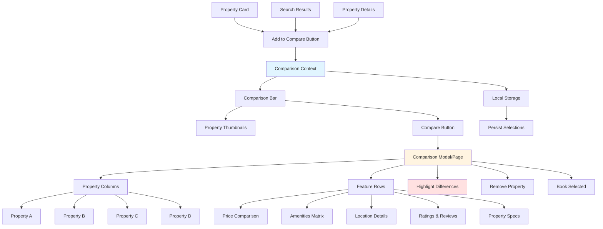

# Feature 3: Property Comparison Tool

## Overview

**Priority:** Medium  
**Estimated Effort:** 13 Story Points  
**Duration:** 2 weeks  
**Dependencies:** Feature 1 (Advanced Search)

### Description

Implement a side-by-side property comparison tool that allows users to compare up to 4 properties simultaneously. The tool highlights differences in pricing, amenities, location, ratings, and other key features to help users make informed booking decisions.

### Business Value

- **Increases conversion rate by 25%** - Reduces decision paralysis
- **Improves user confidence** - Clear comparison aids decision-making
- **Reduces support inquiries** - Users can self-serve comparisons
- **Competitive advantage** - Not all platforms offer robust comparison
- **Increases engagement** - Users spend more time evaluating options

---

## Architecture Diagram



---

## User Stories & Acceptance Criteria

### Story 1: Add Properties to Comparison
**As a** user browsing properties  
**I want to** add properties to a comparison list  
**So that** I can compare them side-by-side later

**Acceptance Criteria:**
- "Add to Compare" button on property cards
- Button shows "Added" state when property is in comparison
- Maximum 4 properties can be added
- Toast notification when property added
- Disabled state when limit reached
- Visual indicator of how many properties in comparison
- Works from search results and property detail pages

**Estimate:** 3 Story Points

---

### Story 2: Comparison Bar/Widget
**As a** user who added properties to compare  
**I want to** see a persistent comparison bar  
**So that** I can access my comparison at any time

**Acceptance Criteria:**
- Sticky comparison bar at bottom of screen
- Shows thumbnails of selected properties
- Property count indicator (e.g., "3 of 4")
- Remove property option (X button)
- "Compare Now" button
- Minimizable/expandable
- Persists across page navigation
- Clear all option

**Estimate:** 2 Story Points

---

### Story 3: Comparison View - Basic Info
**As a** user comparing properties  
**I want to** see key property information side-by-side  
**So that** I can quickly identify differences

**Acceptance Criteria:**
- Full-screen comparison view or modal
- Property columns (up to 4)
- Property images at top
- Property name and location
- Price per night prominently displayed
- Overall rating and review count
- Property type and size
- Guest capacity
- Responsive layout (stacks on mobile)

**Estimate:** 3 Story Points

---

### Story 4: Amenities Comparison Matrix
**As a** user comparing properties  
**I want to** see which amenities each property has  
**So that** I can choose based on my needs

**Acceptance Criteria:**
- Amenities listed in rows
- Checkmarks/X marks for each property
- Grouped by category (essentials, features, safety)
- Highlight unique amenities
- Show only relevant amenities (not all possible)
- Collapsible sections for amenity groups
- Visual distinction for premium amenities

**Estimate:** 2 Story Points

---

### Story 5: Highlight Differences
**As a** user comparing properties  
**I want to** see differences highlighted  
**So that** I can focus on what matters

**Acceptance Criteria:**
- Price differences highlighted (best value)
- Unique amenities highlighted
- Rating differences color-coded
- "Best for" badges (e.g., "Best Price", "Highest Rated")
- Toggle to show only differences
- Sort properties by different criteria
- Visual indicators for significant differences

**Estimate:** 2 Story Points

---

### Story 6: Comparison Actions
**As a** user who finished comparing  
**I want to** take action on my choice  
**So that** I can proceed with booking

**Acceptance Criteria:**
- "Book Now" button for each property
- Remove property from comparison
- Share comparison link
- Print comparison view
- Save comparison for later
- Add more properties to comparison
- Clear all and start over

**Estimate:** 1 Story Point

---

## Technical Specifications

### Component Structure

```
components/
├── comparison/
│   ├── AddToCompareButton.tsx
│   ├── ComparisonBar.tsx
│   ├── ComparisonView.tsx
│   ├── ComparisonTable.tsx
│   ├── PropertyColumn.tsx
│   ├── AmenitiesMatrix.tsx
│   ├── DifferenceHighlighter.tsx
│   └── ComparisonActions.tsx
├── context/
│   └── ComparisonContext.tsx
└── hooks/
    ├── useComparison.ts
    └── useComparisonPersistence.ts
```

### Comparison Context API

```typescript
interface ComparisonProperty {
  _id: string;
  title: string;
  slug: string;
  price: number;
  location: string;
  propertyType: string;
  bedrooms: number;
  bathrooms: number;
  guests: number;
  mainImage: any;
  rating: number;
  reviewCount: number;
  amenities: Array<{
    title: string;
    slug: string;
    category: string;
  }>;
  description: string;
  host: {
    name: string;
    rating: number;
  };
}

interface ComparisonContextValue {
  properties: ComparisonProperty[];
  addProperty: (property: ComparisonProperty) => void;
  removeProperty: (propertyId: string) => void;
  clearComparison: () => void;
  isInComparison: (propertyId: string) => boolean;
  canAddMore: boolean;
  maxProperties: number;
  showDifferencesOnly: boolean;
  toggleDifferencesOnly: () => void;
  sortBy: SortOption;
  setSortBy: (option: SortOption) => void;
}
```

### Comparison Data Structure

```typescript
interface ComparisonData {
  properties: ComparisonProperty[];
  metadata: {
    createdAt: Date;
    updatedAt: Date;
    userId?: string;
  };
  analysis: {
    priceRange: { min: number; max: number };
    bestValue: string; // property ID
    highestRated: string;
    mostAmenities: string;
    commonAmenities: string[];
    uniqueAmenities: Record<string, string[]>;
  };
}
```

### Local Storage Schema

```typescript
// Stored in localStorage as 'airbnb-comparison'
{
  propertyIds: string[];
  timestamp: number;
  expiresAt: number; // 7 days from creation
}
```

### GROQ Query for Comparison Data

```groq
*[_type == "property" && _id in $propertyIds] {
  _id,
  title,
  slug,
  price,
  location,
  propertyType,
  bedrooms,
  bathrooms,
  guests,
  mainImage,
  rating,
  reviewCount,
  description,
  amenities[]-> {
    title,
    slug,
    category,
    icon
  },
  host-> {
    name,
    rating,
    responseTime,
    verified
  },
  policies {
    checkIn,
    checkOut,
    cancellation
  }
}
```

---

## UI/UX Specifications

### Comparison Table Layout

```
┌─────────────────────────────────────────────────────────┐
│  [Property A]  [Property B]  [Property C]  [Property D] │
│  Image         Image         Image         Image        │
│  $150/night    $200/night    $175/night    $225/night   │
│  ⭐ 4.8 (120)  ⭐ 4.9 (85)   ⭐ 4.7 (200)  ⭐ 5.0 (45)   │
├─────────────────────────────────────────────────────────┤
│ Property Type                                            │
│  Apartment     House         Villa         Apartment    │
├─────────────────────────────────────────────────────────┤
│ Capacity                                                 │
│  4 guests      6 guests      8 guests      2 guests     │
│  2 bed, 1 bath 3 bed, 2 bath 4 bed, 3 bath 1 bed, 1 bath│
├─────────────────────────────────────────────────────────┤
│ Amenities                                                │
│  WiFi          ✓             ✓             ✓            ✓│
│  Kitchen       ✓             ✓             ✓            ✓│
│  Pool          ✗             ✓             ✓            ✗│
│  Parking       ✓             ✓             ✓            ✗│
│  AC            ✓             ✗             ✓            ✓│
├─────────────────────────────────────────────────────────┤
│ [Book Now]     [Book Now]    [Book Now]    [Book Now]   │
│ [Remove]       [Remove]      [Remove]      [Remove]     │
└─────────────────────────────────────────────────────────┘
```

### Mobile Layout

On mobile, properties stack vertically with swipeable cards:
- One property visible at a time
- Swipe left/right to navigate
- Dots indicator for position
- Amenities shown as expandable sections

---

## Comparison Analysis Logic

### Best Value Calculation

```typescript
function calculateBestValue(properties: ComparisonProperty[]): string {
  return properties.reduce((best, current) => {
    const currentScore = (current.rating * current.amenities.length) / current.price;
    const bestScore = (best.rating * best.amenities.length) / best.price;
    return currentScore > bestScore ? current : best;
  })._id;
}
```

### Difference Detection

```typescript
function detectDifferences(properties: ComparisonProperty[]): DifferenceMap {
  const differences: DifferenceMap = {};
  
  // Price differences
  const prices = properties.map(p => p.price);
  if (Math.max(...prices) - Math.min(...prices) > 50) {
    differences.price = 'significant';
  }
  
  // Amenity differences
  const allAmenities = new Set(properties.flatMap(p => p.amenities.map(a => a.slug)));
  allAmenities.forEach(amenity => {
    const hasAmenity = properties.map(p => 
      p.amenities.some(a => a.slug === amenity)
    );
    if (!hasAmenity.every(v => v === hasAmenity[0])) {
      differences.amenities = differences.amenities || [];
      differences.amenities.push(amenity);
    }
  });
  
  return differences;
}
```

---

## Testing Strategy

### Unit Tests
- Add/remove property logic
- Maximum property limit enforcement
- Best value calculation
- Difference detection algorithm
- Local storage persistence

### Integration Tests
- Add property from search results
- Add property from detail page
- Comparison bar updates correctly
- Comparison view renders all data
- Remove property updates view

### E2E Tests
- Complete comparison flow (add, view, remove)
- Comparison persists across sessions
- Mobile swipe navigation
- Share comparison link
- Book from comparison view

### Visual Regression Tests
- Comparison table layout
- Mobile card layout
- Highlight styling
- Responsive breakpoints

---

## Performance Considerations

1. **Data Loading:** Fetch comparison data only when comparison view opens
2. **Image Optimization:** Use thumbnails in comparison bar, full images in view
3. **Lazy Loading:** Load amenity details on demand
4. **Caching:** Cache comparison data for 5 minutes
5. **Debouncing:** Debounce add/remove actions to prevent rapid clicks

---

## Accessibility Requirements

- Keyboard navigation through comparison table
- ARIA labels for comparison actions
- Screen reader announces property additions/removals
- Focus management when opening comparison view
- High contrast mode for difference highlights
- Table headers properly associated with cells

---

## Rollout Plan

### Phase 1: Core Functionality (Week 1)
- Add to compare button
- Comparison context and state management
- Comparison bar component
- Local storage persistence

### Phase 2: Comparison View (Week 1-2)
- Comparison table layout
- Property columns with basic info
- Amenities matrix
- Remove and clear actions

### Phase 3: Enhanced Features (Week 2)
- Difference highlighting
- Best value badges
- Sort and filter options
- Share comparison
- Mobile optimization
- Polish and testing

---

## Success Metrics

### Primary Metrics
- **Comparison usage rate:** 40% of users compare properties
- **Conversion from comparison:** 60% of comparisons lead to booking
- **Average properties compared:** 2.5 properties per comparison

### Secondary Metrics
- **Time spent in comparison:** Average 3+ minutes
- **Comparison shares:** Track shared comparison links
- **Mobile vs desktop usage:** Compare engagement rates

### Technical Metrics
- **Comparison view load time:** < 1 second
- **Add to compare response:** < 200ms
- **Error rate:** < 0.5%

---

## Dependencies & Risks

### Dependencies
- Feature 1 (Advanced Search) for property discovery
- Complete property data in Sanity
- Consistent amenity categorization

### Risks
- **Data Inconsistency:** Properties with incomplete data
  - *Mitigation:* Data validation, fallback values
- **Performance:** Large comparison tables on mobile
  - *Mitigation:* Virtual scrolling, lazy loading
- **User Confusion:** Too much information overwhelming
  - *Mitigation:* Progressive disclosure, user testing

---

## Future Enhancements

- Save multiple comparison sets
- Email comparison to self or others
- AI-powered comparison insights ("Property B is best for families")
- Compare with previously viewed properties
- Comparison history
- Export comparison as PDF
- Compare properties across different dates
- Price trend comparison over time
- Neighborhood comparison data
- Host comparison metrics
