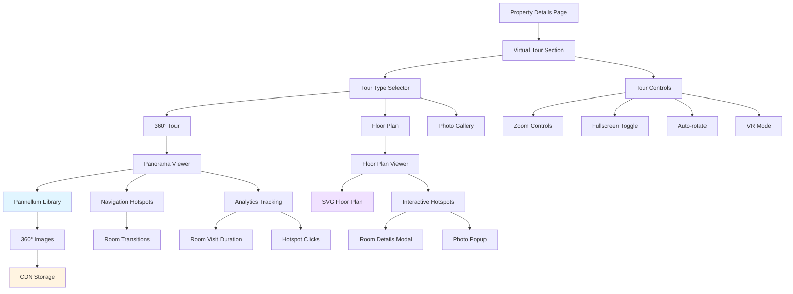

# Feature 4: Interactive Virtual Tours

## Overview

**Priority:** Medium  
**Estimated Effort:** 21 Story Points  
**Duration:** 3 weeks  
**Dependencies:** None

### Description

Implement immersive 360° virtual tours and interactive floor plans for property listings. Users can explore properties remotely through panoramic images, navigate between rooms, view floor plans with hotspots, and get a realistic sense of space before booking.

### Business Value

- **Differentiates from competitors** - Premium feature not widely available
- **Reduces cancellations by 30%** - Better expectations reduce disappointment
- **Increases premium listing appeal** - Hosts willing to pay for virtual tours
- **Improves booking confidence** - Users feel more certain about their choice
- **Reduces support inquiries** - Visual exploration answers many questions

---

## Architecture Diagram



---

## User Stories & Acceptance Criteria

### Story 1: 360° Panorama Viewer
**As a** user viewing a property  
**I want to** explore rooms with 360° panoramic views  
**So that** I can get a realistic sense of the space

**Acceptance Criteria:**
- 360° panoramic image viewer
- Mouse drag to look around
- Touch/swipe support on mobile
- Smooth rotation and zoom
- Initial view faces the room entrance
- Loading indicator for images
- Fallback to regular photos if no 360° available
- Works on all modern browsers

**Estimate:** 5 Story Points

---

### Story 2: Room Navigation & Hotspots
**As a** user in a virtual tour  
**I want to** navigate between rooms  
**So that** I can explore the entire property

**Acceptance Criteria:**
- Clickable hotspots to move between rooms
- Hotspot icons clearly visible
- Smooth transitions between rooms
- Room labels on hotspots
- Breadcrumb trail of visited rooms
- "Return to start" option
- Minimap showing current location
- Keyboard navigation support (arrow keys)

**Estimate:** 5 Story Points

---

### Story 3: Interactive Floor Plan
**As a** user exploring a property  
**I want to** view an interactive floor plan  
**So that** I can understand the layout

**Acceptance Criteria:**
- SVG-based floor plan display
- Clickable rooms on floor plan
- Highlight current room
- Room labels and dimensions
- Zoom and pan controls
- Toggle between floors (if multi-story)
- Hotspots link to 360° views
- Print-friendly version

**Estimate:** 5 Story Points

---

### Story 4: Tour Controls & Features
**As a** user in a virtual tour  
**I want to** control the viewing experience  
**So that** I can explore at my own pace

**Acceptance Criteria:**
- Zoom in/out controls
- Fullscreen mode toggle
- Auto-rotate option
- Gyroscope support on mobile
- VR mode for VR headsets
- Tour guide overlay (optional)
- Mute/unmute ambient audio (if available)
- Share specific room view

**Estimate:** 3 Story Points

---

### Story 5: Tour Information Overlays
**As a** user in a virtual tour  
**I want to** see information about features  
**So that** I can learn about amenities and details

**Acceptance Criteria:**
- Information hotspots in rooms
- Click hotspot to see details
- Feature descriptions and photos
- Amenity highlights (e.g., "Smart TV", "King Bed")
- Measurements for key features
- Close-up photos of details
- Non-intrusive overlay design
- Accessible via keyboard

**Estimate:** 2 Story Points

---

### Story 6: Tour Analytics & Optimization
**As a** property host  
**I want to** see how users interact with virtual tours  
**So that** I can optimize my listing

**Acceptance Criteria:**
- Track which rooms are viewed most
- Measure time spent in each room
- Track hotspot interaction rates
- Completion rate of full tour
- Device type analytics
- Heatmap of user attention
- Export analytics report
- Dashboard view for hosts

**Estimate:** 1 Story Point

---

## Technical Specifications

### Component Structure

```
components/
├── virtualTour/
│   ├── VirtualTourViewer.tsx
│   ├── PanoramaViewer.tsx
│   ├── FloorPlanViewer.tsx
│   ├── TourControls.tsx
│   ├── NavigationHotspot.tsx
│   ├── InfoHotspot.tsx
│   ├── RoomTransition.tsx
│   ├── TourMinimap.tsx
│   └── VRModeButton.tsx
├── context/
│   └── VirtualTourContext.tsx
└── hooks/
    ├── useVirtualTour.ts
    ├── usePanorama.ts
    └── useTourAnalytics.ts
```

### Virtual Tour Context API

```typescript
interface TourRoom {
  id: string;
  name: string;
  panoramaUrl: string;
  thumbnailUrl: string;
  hotspots: Hotspot[];
  floorPlanPosition: { x: number; y: number };
  initialView: { pitch: number; yaw: number };
}

interface Hotspot {
  id: string;
  type: 'navigation' | 'info';
  position: { pitch: number; yaw: number };
  targetRoomId?: string;
  content?: {
    title: string;
    description: string;
    image?: string;
  };
}

interface VirtualTourContextValue {
  currentRoom: TourRoom | null;
  rooms: TourRoom[];
  navigateToRoom: (roomId: string) => void;
  isFullscreen: boolean;
  toggleFullscreen: () => void;
  autoRotate: boolean;
  toggleAutoRotate: () => void;
  viewMode: 'panorama' | 'floorplan' | 'gallery';
  setViewMode: (mode: string) => void;
  tourProgress: number;
  visitedRooms: string[];
  trackInteraction: (event: TourEvent) => void;
}
```

### Pannellum Configuration

```typescript
// Using Pannellum library for 360° panoramas
import { Viewer } from 'pannellum-react';

const panoramaConfig = {
  type: 'equirectangular',
  autoLoad: true,
  autoRotate: -2, // Rotation speed
  compass: true,
  showControls: true,
  showFullscreenCtrl: true,
  showZoomCtrl: true,
  mouseZoom: true,
  draggable: true,
  keyboardZoom: true,
  hotSpots: [
    {
      pitch: 10,
      yaw: 20,
      type: 'scene',
      text: 'Living Room',
      sceneId: 'living-room'
    },
    {
      pitch: -5,
      yaw: 180,
      type: 'info',
      text: 'Smart TV',
      description: '55" 4K Smart TV with streaming apps'
    }
  ]
};
```

### Sanity Schema - Virtual Tour

```javascript
{
  name: 'virtualTour',
  title: 'Virtual Tour',
  type: 'object',
  fields: [
    {
      name: 'enabled',
      title: 'Enable Virtual Tour',
      type: 'boolean',
      initialValue: false
    },
    {
      name: 'rooms',
      title: 'Tour Rooms',
      type: 'array',
      of: [{
        type: 'object',
        fields: [
          {
            name: 'name',
            title: 'Room Name',
            type: 'string',
            validation: Rule => Rule.required()
          },
          {
            name: 'panoramaImage',
            title: '360° Panorama Image',
            type: 'image',
            description: 'Equirectangular 360° image (2:1 aspect ratio)',
            validation: Rule => Rule.required()
          },
          {
            name: 'thumbnail',
            title: 'Room Thumbnail',
            type: 'image'
          },
          {
            name: 'initialView',
            title: 'Initial View Direction',
            type: 'object',
            fields: [
              { name: 'pitch', type: 'number', initialValue: 0 },
              { name: 'yaw', type: 'number', initialValue: 0 }
            ]
          },
          {
            name: 'hotspots',
            title: 'Hotspots',
            type: 'array',
            of: [{
              type: 'object',
              fields: [
                {
                  name: 'type',
                  type: 'string',
                  options: {
                    list: [
                      { title: 'Navigation', value: 'navigation' },
                      { title: 'Information', value: 'info' }
                    ]
                  }
                },
                {
                  name: 'position',
                  type: 'object',
                  fields: [
                    { name: 'pitch', type: 'number' },
                    { name: 'yaw', type: 'number' }
                  ]
                },
                {
                  name: 'targetRoom',
                  type: 'string',
                  hidden: ({ parent }) => parent?.type !== 'navigation'
                },
                {
                  name: 'title',
                  type: 'string',
                  hidden: ({ parent }) => parent?.type !== 'info'
                },
                {
                  name: 'description',
                  type: 'text',
                  hidden: ({ parent }) => parent?.type !== 'info'
                },
                {
                  name: 'image',
                  type: 'image',
                  hidden: ({ parent }) => parent?.type !== 'info'
                }
              ]
            }]
          }
        ]
      }]
    },
    {
      name: 'floorPlan',
      title: 'Floor Plan',
      type: 'object',
      fields: [
        {
          name: 'image',
          title: 'Floor Plan Image',
          type: 'image',
          description: 'SVG or high-res PNG'
        },
        {
          name: 'roomPositions',
          title: 'Room Positions on Floor Plan',
          type: 'array',
          of: [{
            type: 'object',
            fields: [
              { name: 'roomName', type: 'string' },
              { name: 'x', type: 'number', description: 'X coordinate (%)' },
              { name: 'y', type: 'number', description: 'Y coordinate (%)' }
            ]
          }]
        }
      ]
    },
    {
      name: 'ambientAudio',
      title: 'Ambient Audio',
      type: 'file',
      description: 'Optional background audio for immersion'
    }
  ]
}
```

### Floor Plan SVG Structure

```xml
<svg viewBox="0 0 1000 800" xmlns="http://www.w3.org/2000/svg">
  <!-- Floor plan outline -->
  <path d="M 100 100 L 900 100 L 900 700 L 100 700 Z" 
        fill="#f5f5f5" stroke="#333" stroke-width="2"/>
  
  <!-- Rooms -->
  <g id="living-room" class="room" data-room-id="living-room">
    <rect x="100" y="100" width="400" height="300" 
          fill="#fff" stroke="#666" stroke-width="1"/>
    <text x="300" y="250" text-anchor="middle">Living Room</text>
    <circle cx="300" cy="250" r="20" class="hotspot" 
            data-panorama="living-room-360"/>
  </g>
  
  <g id="bedroom" class="room" data-room-id="bedroom">
    <rect x="500" y="100" width="400" height="300" 
          fill="#fff" stroke="#666" stroke-width="1"/>
    <text x="700" y="250" text-anchor="middle">Bedroom</text>
    <circle cx="700" cy="250" r="20" class="hotspot" 
            data-panorama="bedroom-360"/>
  </g>
  
  <!-- Doors -->
  <line x1="500" y1="250" x2="500" y2="300" 
        stroke="#333" stroke-width="3" class="door"/>
</svg>
```

---

## Image Requirements & Optimization

### 360° Panorama Images
- **Format:** Equirectangular projection (2:1 aspect ratio)
- **Resolution:** 4096x2048 or 8192x4096 for high quality
- **File Format:** JPEG (optimized) or WebP
- **File Size:** < 5MB per image (compressed)
- **Naming:** `{property-id}-{room-name}-360.jpg`

### Floor Plans
- **Format:** SVG (preferred) or PNG
- **Resolution:** 2000x1600 minimum for PNG
- **File Size:** < 500KB
- **Interactive Elements:** Embedded in SVG as data attributes

### CDN Strategy
- Store all tour assets on CDN (Cloudinary, AWS CloudFront)
- Progressive loading (low-res preview → high-res)
- Lazy load non-visible rooms
- Cache aggressively (30 days)

---

## Testing Strategy

### Unit Tests
- Hotspot position calculations
- Room navigation logic
- View angle calculations
- Analytics event tracking

### Integration Tests
- Panorama viewer initialization
- Room transitions
- Floor plan interactions
- Fullscreen mode
- Mobile gyroscope integration

### E2E Tests
- Complete tour navigation
- All hotspot types functional
- Floor plan to panorama navigation
- VR mode activation
- Analytics data collection

### Performance Tests
- Image loading time < 3 seconds
- Smooth rotation (60fps)
- Memory usage with multiple rooms
- Mobile device performance

### Compatibility Tests
- Chrome, Firefox, Safari, Edge
- iOS Safari, Android Chrome
- VR headset compatibility (Oculus, Cardboard)
- Screen reader navigation

---

## Performance Considerations

1. **Image Optimization:**
   - Progressive JPEG loading
   - WebP format with JPEG fallback
   - Responsive image sizes
   - Preload next likely room

2. **Rendering:**
   - WebGL acceleration for panoramas
   - Throttle rotation events
   - Debounce zoom controls
   - Virtual DOM for hotspots

3. **Memory Management:**
   - Unload panoramas when not visible
   - Limit cached rooms to 3
   - Dispose of WebGL contexts properly

4. **Mobile Optimization:**
   - Lower resolution images on mobile
   - Disable auto-rotate on mobile
   - Touch gesture optimization
   - Reduce hotspot density

---

## Accessibility Requirements

- Keyboard navigation (Tab, Arrow keys, Enter)
- ARIA labels for all interactive elements
- Screen reader descriptions of rooms
- Alternative text descriptions for panoramas
- High contrast mode support
- Focus indicators on hotspots
- Skip navigation option
- Captions for audio descriptions

---

## VR Mode Implementation

### WebXR API Integration

```typescript
async function enterVRMode() {
  if ('xr' in navigator) {
    const xrSession = await navigator.xr.requestSession('immersive-vr');
    
    // Initialize VR rendering
    const gl = canvas.getContext('webgl', { xrCompatible: true });
    const xrLayer = new XRWebGLLayer(xrSession, gl);
    
    xrSession.updateRenderState({ baseLayer: xrLayer });
    
    // Start VR render loop
    xrSession.requestAnimationFrame(onXRFrame);
  }
}
```

### Cardboard Support
- Google Cardboard SDK integration
- Side-by-side stereoscopic rendering
- Gyroscope-based head tracking
- Gaze-based hotspot selection

---

## Rollout Plan

### Phase 1: Core Panorama Viewer (Week 1)
- Pannellum integration
- Basic 360° image display
- Mouse/touch controls
- Zoom and rotation
- Loading states

### Phase 2: Navigation & Hotspots (Week 1-2)
- Navigation hotspots
- Room transitions
- Info hotspots
- Hotspot content modals
- Room breadcrumbs

### Phase 3: Floor Plan Integration (Week 2)
- Floor plan viewer
- Interactive room selection
- Floor plan to panorama linking
- Multi-floor support
- Minimap integration

### Phase 4: Advanced Features (Week 2-3)
- Fullscreen mode
- Auto-rotate
- VR mode
- Gyroscope support
- Ambient audio
- Tour analytics

### Phase 5: Polish & Optimization (Week 3)
- Performance optimization
- Mobile optimization
- Accessibility audit
- Cross-browser testing
- User testing and refinements

---

## Success Metrics

### Primary Metrics
- **Tour engagement rate:** 60% of property viewers start tour
- **Tour completion rate:** 40% view all rooms
- **Booking conversion:** 15% increase for properties with tours

### Secondary Metrics
- **Average tour duration:** 3+ minutes
- **Rooms viewed per tour:** Average 4 rooms
- **VR mode usage:** Track adoption rate
- **Mobile vs desktop:** Compare engagement

### Technical Metrics
- **Load time:** < 3 seconds for first panorama
- **Frame rate:** 60fps during rotation
- **Error rate:** < 1%
- **Browser compatibility:** 95%+ users supported

---

## Dependencies & Risks

### Dependencies
- Pannellum or similar 360° viewer library
- CDN for image hosting
- WebGL support in browsers
- Property owners providing 360° images

### Risks
- **Content Creation:** Getting 360° images from hosts
  - *Mitigation:* Partner with 360° photography services, provide guidelines
- **File Size:** Large panorama files slow loading
  - *Mitigation:* Aggressive compression, progressive loading, CDN
- **Browser Support:** Older browsers may not support WebGL
  - *Mitigation:* Graceful degradation to photo gallery
- **Mobile Performance:** Heavy processing on mobile devices
  - *Mitigation:* Lower resolution images, simplified rendering

---

## Content Creation Guidelines

### For Property Hosts

**Equipment Needed:**
- 360° camera (Ricoh Theta, Insta360, etc.)
- Tripod for stable shots
- Good lighting

**Best Practices:**
- Shoot during daytime with natural light
- Clean and stage rooms before shooting
- Take photos from room center at eye level
- Capture all major rooms
- Avoid people and pets in shots
- Shoot in highest resolution possible

**Recommended Services:**
- Matterport (professional 3D tours)
- Local 360° photographers
- DIY with consumer 360° cameras

---

## Future Enhancements

- AI-generated virtual tours from regular photos
- Live video tours with hosts
- Augmented reality (AR) furniture placement
- Measure tool for room dimensions
- Virtual staging (add/remove furniture)
- Seasonal tour variations
- Neighborhood virtual tours
- Integration with Google Street View
- Voice-guided tours
- Multi-language tour narration
- Social features (tour with friends)
- Comparison of multiple properties in VR
