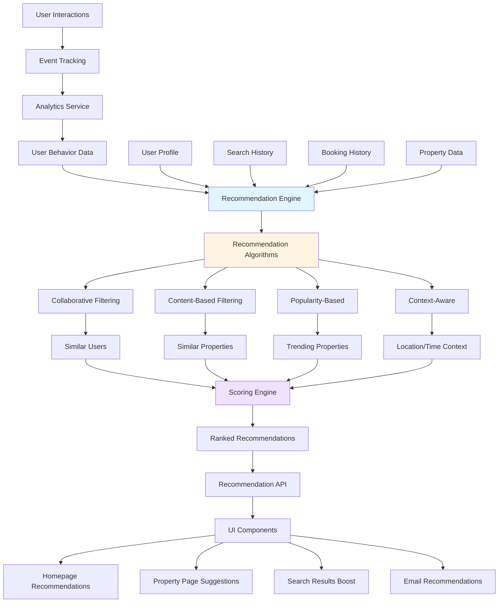

# Feature 5: Smart Recommendations Engine

## Overview

**Priority:** High  
**Estimated Effort:** 21 Story Points  
**Duration:** 3 weeks  
**Dependencies:** Feature 2 (User Authentication - optional but enhances personalization)

### Description

Implement an AI-powered recommendation system that suggests properties based on user behavior, preferences, search history, and collaborative filtering. The system learns from user interactions to provide increasingly personalized recommendations, improving discovery and engagement.

### Business Value

- **Increases cross-selling by 40%** - Users discover more properties
- **Improves engagement by 35%** - Personalized content keeps users interested
- **Reduces search abandonment by 30%** - Relevant suggestions prevent frustration
- **Increases session duration** - Users explore recommended properties
- **Competitive advantage** - Sophisticated personalization differentiates platform

---

## Architecture Diagram



---

## User Stories & Acceptance Criteria

### Story 1: Personalized Homepage Recommendations
**As a** user visiting the homepage  
**I want to** see property recommendations tailored to me  
**So that** I can quickly find properties I might like

**Acceptance Criteria:**
- "Recommended for You" section on homepage
- Shows 6-12 personalized properties
- Updates based on user behavior
- Different recommendations for logged-in vs anonymous users
- Refresh recommendations option
- Explanation of why property is recommended (optional)
- Fallback to popular properties for new users
- Responsive carousel layout

**Estimate:** 5 Story Points

---

### Story 2: Similar Properties Suggestions
**As a** user viewing a property  
**I want to** see similar properties  
**So that** I can compare options

**Acceptance Criteria:**
- "Similar Properties" section on property detail page
- Shows 4-6 similar properties
- Based on location, price, type, amenities
- Highlights key similarities
- Click to view similar property
- "See More" option for extended list
- Updates when property changes
- Excludes already viewed properties

**Estimate:** 3 Story Points

---

### Story 3: "Users Also Viewed" Recommendations
**As a** user browsing properties  
**I want to** see what other users viewed  
**So that** I can discover popular alternatives

**Acceptance Criteria:**
- "Users who viewed this also viewed" section
- Based on collaborative filtering
- Shows 4-6 properties
- Real-time or near-real-time updates
- Excludes current property
- Tracks click-through rate
- Works for anonymous users
- Privacy-preserving (no personal data exposed)

**Estimate:** 5 Story Points

---

### Story 4: Smart Search Result Ranking
**As a** user searching for properties  
**I want to** see results ranked by relevance to me  
**So that** I find the best matches faster

**Acceptance Criteria:**
- Search results incorporate personalization
- Boost properties matching user preferences
- Consider past interactions and bookings
- Balance relevance with diversity
- Option to sort by "Recommended" vs "Price" etc.
- Transparent ranking (show why boosted)
- A/B test personalized vs standard ranking
- Performance: < 500ms additional latency

**Estimate:** 5 Story Points

---

### Story 5: Contextual Recommendations
**As a** user in different contexts  
**I want to** see recommendations appropriate to my situation  
**So that** suggestions are relevant

**Acceptance Criteria:**
- Time-based recommendations (weekend getaways on Fridays)
- Location-based (properties near user's location)
- Season-appropriate (beach in summer, ski in winter)
- Event-based (properties near upcoming events)
- Budget-aware (match user's price range)
- Group size appropriate (match typical guest count)
- Device-aware (mobile vs desktop behavior)
- Weather-influenced suggestions

**Estimate:** 3 Story Points

---

## Technical Specifications

### Component Structure

```
components/
├── recommendations/
│   ├── RecommendationCarousel.tsx
│   ├── SimilarProperties.tsx
│   ├── UsersAlsoViewed.tsx
│   ├── PersonalizedSection.tsx
│   └── RecommendationCard.tsx
├── context/
│   └── RecommendationsContext.tsx
└── hooks/
    ├── useRecommendations.ts
    ├── useUserBehavior.ts
    └── usePersonalization.ts
```

### Recommendation Engine Architecture

```typescript
interface RecommendationRequest {
  userId?: string;
  sessionId: string;
  context: {
    currentPropertyId?: string;
    searchQuery?: string;
    location?: { lat: number; lng: number };
    dateRange?: { checkIn: Date; checkOut: Date };
    priceRange?: { min: number; max: number };
    device: 'mobile' | 'desktop';
  };
  limit: number;
  excludePropertyIds?: string[];
}

interface RecommendationResponse {
  recommendations: Array<{
    property: Property;
    score: number;
    reason: string;
    algorithm: string;
  }>;
  metadata: {
    generatedAt: Date;
    algorithms: string[];
    personalizationLevel: 'high' | 'medium' | 'low';
  };
}

interface UserBehavior {
  userId?: string;
  sessionId: string;
  events: Array<{
    type: 'view' | 'click' | 'search' | 'bookmark' | 'book';
    propertyId?: string;
    timestamp: Date;
    metadata?: any;
  }>;
  preferences: {
    priceRange?: { min: number; max: number };
    propertyTypes?: string[];
    amenities?: string[];
    locations?: string[];
  };
}
```

### Recommendation Algorithms

#### 1. Collaborative Filtering

```typescript
/**
 * Find properties liked by similar users
 * Uses user-item interaction matrix
 */
async function collaborativeFiltering(
  userId: string,
  limit: number
): Promise<Property[]> {
  // Find users with similar behavior
  const similarUsers = await findSimilarUsers(userId, 10);
  
  // Get properties they liked but current user hasn't seen
  const candidateProperties = await getPropertiesLikedBy(similarUsers);
  
  // Score based on similarity and popularity
  const scored = candidateProperties.map(property => ({
    property,
    score: calculateCollaborativeScore(property, similarUsers)
  }));
  
  return scored
    .sort((a, b) => b.score - a.score)
    .slice(0, limit)
    .map(item => item.property);
}

function calculateCollaborativeScore(
  property: Property,
  similarUsers: User[]
): number {
  let score = 0;
  
  similarUsers.forEach(user => {
    const similarity = user.similarityScore;
    const interaction = user.interactions[property._id];
    
    if (interaction) {
      score += similarity * interaction.weight;
    }
  });
  
  return score;
}
```

#### 2. Content-Based Filtering

```typescript
/**
 * Find properties similar to ones user liked
 * Uses property features and attributes
 */
async function contentBasedFiltering(
  userPreferences: UserPreferences,
  limit: number
): Promise<Property[]> {
  // Build user preference profile
  const preferenceVector = buildPreferenceVector(userPreferences);
  
  // Get all properties
  const allProperties = await getAllProperties();
  
  // Calculate similarity scores
  const scored = allProperties.map(property => ({
    property,
    score: cosineSimilarity(
      preferenceVector,
      buildPropertyVector(property)
    )
  }));
  
  return scored
    .sort((a, b) => b.score - a.score)
    .slice(0, limit)
    .map(item => item.property);
}

function buildPropertyVector(property: Property): number[] {
  return [
    normalizePrice(property.price),
    property.bedrooms / 10,
    property.bathrooms / 10,
    property.guests / 20,
    ...encodeAmenities(property.amenities),
    ...encodeLocation(property.location),
    property.rating / 5
  ];
}

function cosineSimilarity(vecA: number[], vecB: number[]): number {
  const dotProduct = vecA.reduce((sum, a, i) => sum + a * vecB[i], 0);
  const magnitudeA = Math.sqrt(vecA.reduce((sum, a) => sum + a * a, 0));
  const magnitudeB = Math.sqrt(vecB.reduce((sum, b) => sum + b * b, 0));
  
  return dotProduct / (magnitudeA * magnitudeB);
}
```

#### 3. Popularity-Based

```typescript
/**
 * Trending and popular properties
 * Time-decayed popularity score
 */
async function popularityBasedRecommendations(
  context: Context,
  limit: number
): Promise<Property[]> {
  const timeWindow = 7; // days
  const now = new Date();
  
  const properties = await getPropertiesWithStats(timeWindow);
  
  const scored = properties.map(property => ({
    property,
    score: calculatePopularityScore(property, now)
  }));
  
  return scored
    .sort((a, b) => b.score - a.score)
    .slice(0, limit)
    .map(item => item.property);
}

function calculatePopularityScore(
  property: PropertyWithStats,
  now: Date
): number {
  const daysSinceView = (now - property.lastViewed) / (1000 * 60 * 60 * 24);
  const timeDecay = Math.exp(-daysSinceView / 7); // Decay over 7 days
  
  return (
    property.viewCount * 1.0 +
    property.bookingCount * 10.0 +
    property.rating * 2.0
  ) * timeDecay;
}
```

#### 4. Hybrid Approach

```typescript
/**
 * Combine multiple algorithms with weighted scoring
 */
async function hybridRecommendations(
  request: RecommendationRequest
): Promise<RecommendationResponse> {
  const [collaborative, contentBased, popular, contextual] = await Promise.all([
    collaborativeFiltering(request.userId, 20),
    contentBasedFiltering(request.context, 20),
    popularityBasedRecommendations(request.context, 20),
    contextualRecommendations(request.context, 20)
  ]);
  
  // Combine and deduplicate
  const allRecommendations = new Map<string, ScoredProperty>();
  
  const weights = {
    collaborative: 0.35,
    contentBased: 0.30,
    popular: 0.20,
    contextual: 0.15
  };
  
  addWeightedScores(allRecommendations, collaborative, weights.collaborative, 'collaborative');
  addWeightedScores(allRecommendations, contentBased, weights.contentBased, 'content-based');
  addWeightedScores(allRecommendations, popular, weights.popular, 'popularity');
  addWeightedScores(allRecommendations, contextual, weights.contextual, 'contextual');
  
  // Sort by combined score and apply diversity
  const ranked = Array.from(allRecommendations.values())
    .sort((a, b) => b.score - a.score);
  
  const diversified = applyDiversification(ranked, request.limit);
  
  return {
    recommendations: diversified,
    metadata: {
      generatedAt: new Date(),
      algorithms: ['collaborative', 'content-based', 'popularity', 'contextual'],
      personalizationLevel: determinePersonalizationLevel(request)
    }
  };
}
```

### Event Tracking

```typescript
// Track user interactions for recommendation engine
interface TrackingEvent {
  userId?: string;
  sessionId: string;
  eventType: 'property_view' | 'property_click' | 'search' | 'bookmark' | 'booking';
  propertyId?: string;
  metadata?: {
    source?: string; // 'search', 'recommendation', 'direct'
    position?: number; // Position in list
    searchQuery?: string;
    filters?: any;
  };
  timestamp: Date;
}

// Client-side tracking
function trackEvent(event: Omit<TrackingEvent, 'timestamp'>) {
  const fullEvent = {
    ...event,
    timestamp: new Date()
  };
  
  // Send to analytics service
  fetch('/api/analytics/track', {
    method: 'POST',
    headers: { 'Content-Type': 'application/json' },
    body: JSON.stringify(fullEvent)
  });
  
  // Also store locally for immediate use
  updateLocalBehaviorProfile(fullEvent);
}
```

### Sanity Schema - User Preferences

```javascript
{
  name: 'userPreferences',
  title: 'User Preferences',
  type: 'object',
  fields: [
    {
      name: 'priceRange',
      title: 'Preferred Price Range',
      type: 'object',
      fields: [
        { name: 'min', type: 'number' },
        { name: 'max', type: 'number' }
      ]
    },
    {
      name: 'propertyTypes',
      title: 'Preferred Property Types',
      type: 'array',
      of: [{ type: 'string' }]
    },
    {
      name: 'amenities',
      title: 'Preferred Amenities',
      type: 'array',
      of: [{ type: 'reference', to: [{ type: 'amenity' }] }]
    },
    {
      name: 'locations',
      title: 'Favorite Locations',
      type: 'array',
      of: [{ type: 'string' }]
    },
    {
      name: 'travelStyle',
      title: 'Travel Style',
      type: 'string',
      options: {
        list: [
          { title: 'Budget', value: 'budget' },
          { title: 'Comfort', value: 'comfort' },
          { title: 'Luxury', value: 'luxury' },
          { title: 'Adventure', value: 'adventure' },
          { title: 'Family', value: 'family' }
        ]
      }
    }
  ]
}
```

### API Routes

```typescript
// pages/api/recommendations/personalized.ts
export default async function handler(req: NextApiRequest, res: NextApiResponse) {
  const { userId, sessionId, limit = 12 } = req.query;
  
  const recommendations = await getPersonalizedRecommendations({
    userId: userId as string,
    sessionId: sessionId as string,
    context: extractContext(req),
    limit: Number(limit)
  });
  
  res.json(recommendations);
}

// pages/api/recommendations/similar.ts
export default async function handler(req: NextApiRequest, res: NextApiResponse) {
  const { propertyId, limit = 6 } = req.query;
  
  const similar = await getSimilarProperties(
    propertyId as string,
    Number(limit)
  );
  
  res.json(similar);
}

// pages/api/recommendations/trending.ts
export default async function handler(req: NextApiRequest, res: NextApiResponse) {
  const { location, limit = 12 } = req.query;
  
  const trending = await getTrendingProperties({
    location: location as string,
    limit: Number(limit)
  });
  
  res.json(trending);
}
```

---

## Testing Strategy

### Unit Tests
- Similarity calculation functions
- Score normalization
- Vector operations (cosine similarity)
- Time decay calculations
- Preference extraction logic

### Integration Tests
- Event tracking pipeline
- Recommendation API endpoints
- User behavior aggregation
- Cache invalidation
- Database queries

### A/B Tests
- Personalized vs non-personalized recommendations
- Different algorithm weights
- Recommendation placement and layout
- Number of recommendations shown
- Explanation text effectiveness

### Performance Tests
- Recommendation generation time < 500ms
- Handle 1000+ concurrent requests
- Cache hit rate > 80%
- Database query optimization
- Memory usage under load

---

## Performance Considerations

1. **Caching Strategy:**
   - Cache recommendations for 1 hour
   - User-specific cache with session ID
   - Invalidate on user actions (bookmark, booking)
   - Pre-generate popular recommendations

2. **Computation Optimization:**
   - Pre-compute similarity matrices
   - Batch process user behavior data
   - Use approximate nearest neighbor algorithms
   - Limit candidate set before scoring

3. **Database Optimization:**
   - Index on frequently queried fields
   - Denormalize recommendation data
   - Use read replicas for queries
   - Implement query result caching

4. **Real-time vs Batch:**
   - Real-time: User session behavior
   - Batch: Collaborative filtering models (daily)
   - Hybrid: Update incrementally

---

## Privacy & Ethics

### Privacy Considerations
- Anonymous user tracking (no PII in events)
- GDPR compliance (right to be forgotten)
- Opt-out option for personalization
- Transparent data usage policy
- Secure storage of behavior data

### Ethical Considerations
- Avoid filter bubbles (ensure diversity)
- No discriminatory recommendations
- Transparent pricing (no personalized price gouging)
- User control over personalization
- Explainable recommendations

### Data Retention
- Behavior data: 90 days
- Aggregated statistics: Indefinite
- User preferences: Until account deletion
- Anonymous sessions: 30 days

---

## Rollout Plan

### Phase 1: Foundation (Week 1)
- Event tracking infrastructure
- Basic user behavior storage
- Popularity-based recommendations
- Homepage recommendation section

### Phase 2: Content-Based (Week 1-2)
- Property similarity calculations
- "Similar Properties" feature
- Content-based filtering algorithm
- Property detail page integration

### Phase 3: Collaborative (Week 2)
- User similarity calculations
- "Users Also Viewed" feature
- Collaborative filtering algorithm
- Session-based recommendations

### Phase 4: Hybrid & Optimization (Week 2-3)
- Combine multiple algorithms
- Smart search ranking
- Contextual recommendations
- Performance optimization
- Caching implementation

### Phase 5: Testing & Refinement (Week 3)
- A/B testing setup
- Algorithm tuning
- User feedback collection
- Analytics dashboard
- Documentation

---

## Success Metrics

### Primary Metrics
- **Recommendation CTR:** 15%+ click-through rate
- **Conversion lift:** 20% increase in bookings from recommendations
- **Engagement:** 30% increase in properties viewed per session

### Secondary Metrics
- **Recommendation coverage:** 90%+ users see personalized recommendations
- **Diversity score:** Recommendations span multiple categories
- **Serendipity:** 20% of recommendations are "surprising but relevant"
- **User satisfaction:** Survey ratings for recommendation quality

### Technical Metrics
- **Response time:** < 500ms for recommendation generation
- **Cache hit rate:** > 80%
- **Algorithm accuracy:** Precision@10 > 0.3
- **System uptime:** 99.9%

### Business Metrics
- **Revenue per user:** 25% increase
- **Session duration:** 40% increase
- **Return visit rate:** 30% increase
- **Email engagement:** 2x click rate for recommendation emails

---

## Dependencies & Risks

### Dependencies
- Analytics infrastructure for event tracking
- Sufficient user behavior data (cold start problem)
- Property data completeness
- Computing resources for model training

### Risks
- **Cold Start Problem:** New users/properties have no data
  - *Mitigation:* Fallback to popularity-based, ask for preferences
- **Data Sparsity:** Not enough interactions for accurate recommendations
  - *Mitigation:* Hybrid approach, content-based fallback
- **Performance:** Complex algorithms may be slow
  - *Mitigation:* Aggressive caching, pre-computation, optimization
- **Privacy Concerns:** Users worried about tracking
  - *Mitigation:* Transparency, opt-out, GDPR compliance
- **Filter Bubble:** Users only see similar properties
  - *Mitigation:* Diversity injection, exploration vs exploitation balance

---

## Machine Learning Enhancement (Future)

### Advanced Algorithms
- Deep learning models (neural collaborative filtering)
- Recurrent neural networks for sequence prediction
- Reinforcement learning for exploration/exploitation
- Natural language processing for review analysis
- Computer vision for image similarity

### Feature Engineering
- Time-series features (seasonality, trends)
- Graph-based features (property networks)
- Text embeddings from descriptions
- Image embeddings from photos
- User journey patterns

### Model Training Pipeline
- Automated feature extraction
- Hyperparameter tuning
- A/B testing framework
- Model versioning and rollback
- Continuous learning from feedback

---

## Future Enhancements

- Email recommendations (weekly digest)
- Push notifications for personalized deals
- "Surprise Me" feature (random quality recommendations)
- Social recommendations (friends' favorites)
- Wishlist-based recommendations
- Price drop alerts for viewed properties
- Seasonal recommendations
- Event-based suggestions (concerts, festivals)
- Multi-destination trip planning
- Group travel recommendations
- Accessibility-focused recommendations
- Sustainable/eco-friendly property suggestions
- Pet-friendly property recommendations
- Work-from-anywhere recommendations for remote workers
