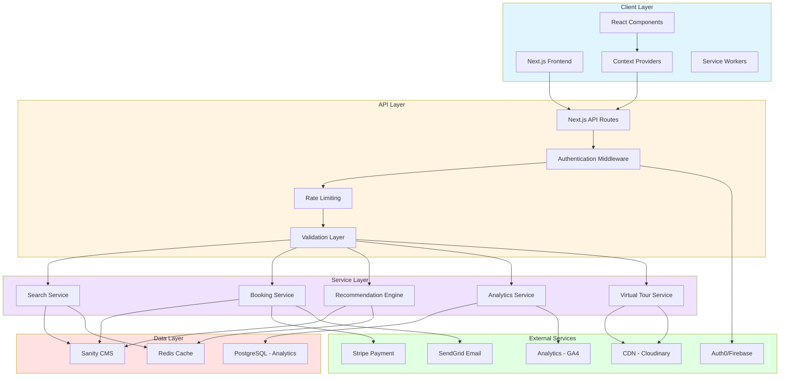
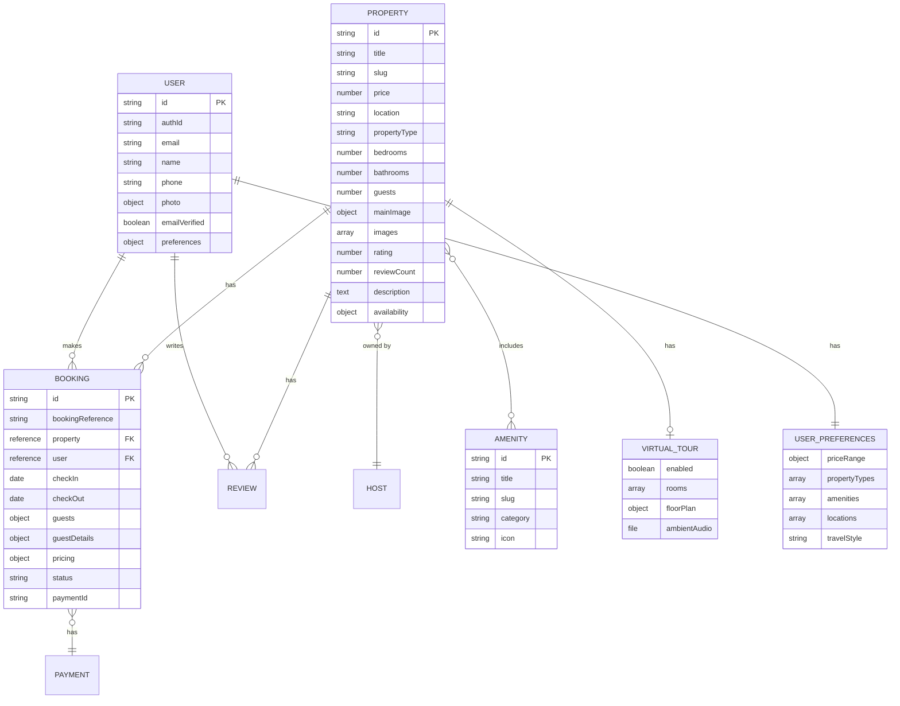
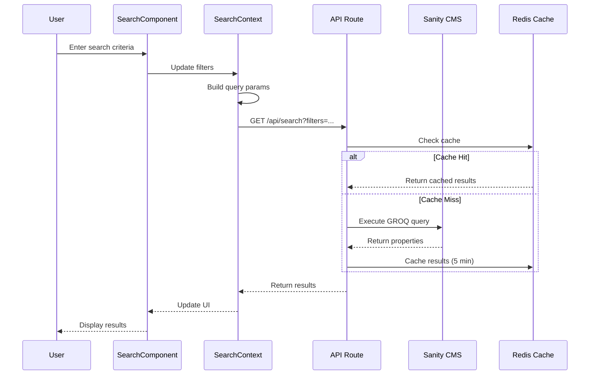
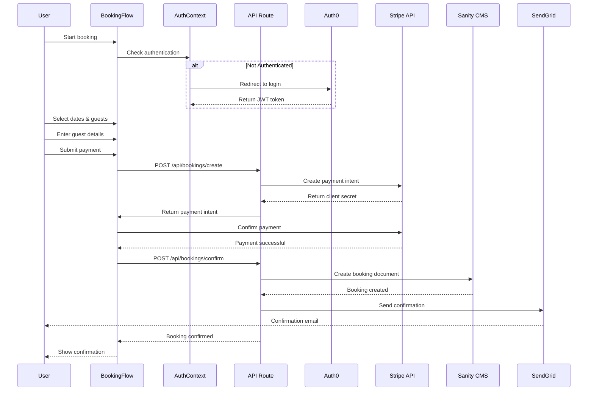
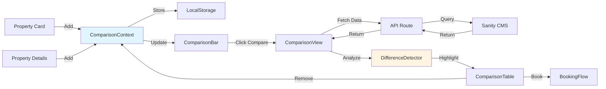
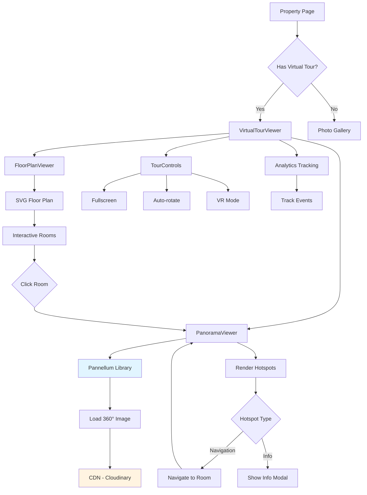
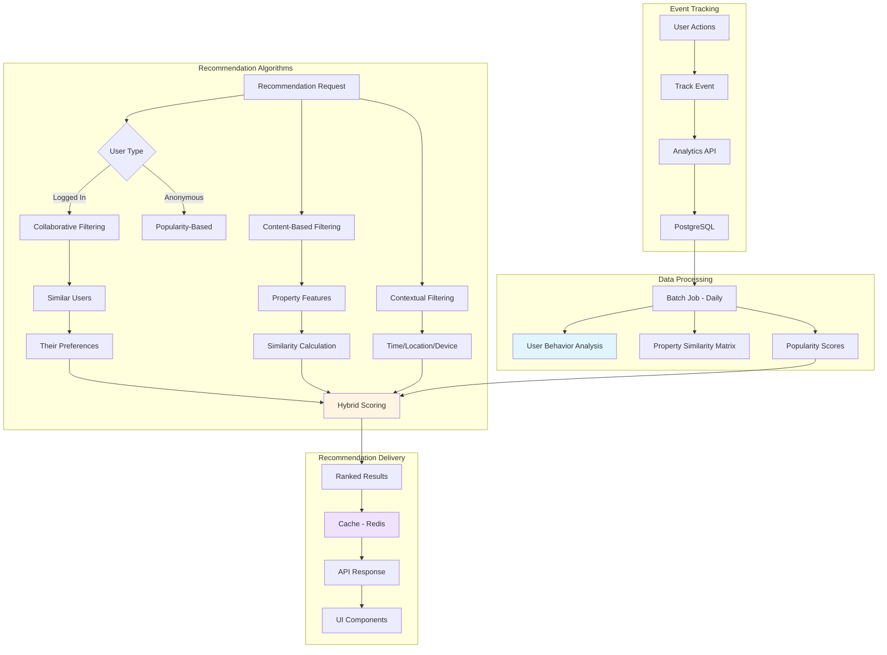
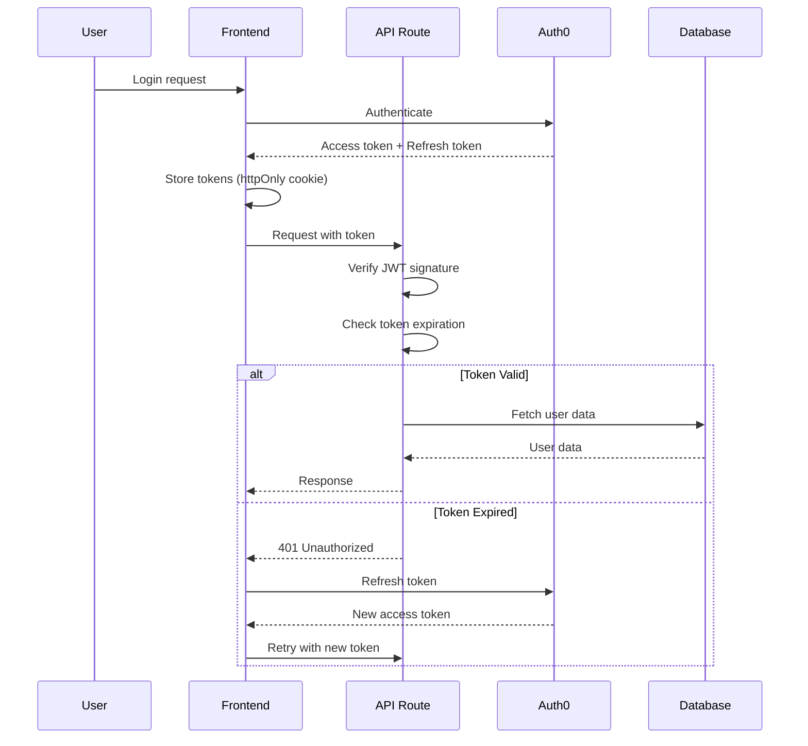
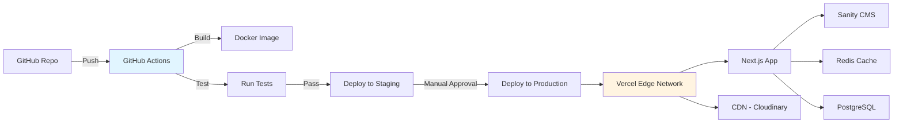

# Technical Architecture Overview

## System Architecture

This document provides a comprehensive technical architecture overview for all 5 proposed features, including system design, technology stack, data flow, and integration points.

---

## High-Level Architecture Diagram



---

## Technology Stack

### Frontend
- **Framework:** Next.js 14 (App Router)
- **Language:** TypeScript
- **UI Library:** React 18
- **Styling:** Tailwind CSS
- **State Management:** React Context API + Zustand (for complex state)
- **Forms:** React Hook Form + Zod validation
- **HTTP Client:** Fetch API with custom wrapper
- **Date Handling:** date-fns
- **Virtual Tours:** Pannellum.js
- **Maps:** Mapbox GL JS
- **Charts:** Recharts
- **Testing:** Jest + React Testing Library + Playwright

### Backend
- **Runtime:** Node.js 20+
- **API:** Next.js API Routes (serverless)
- **CMS:** Sanity.io
- **Authentication:** Auth0 or Firebase Auth
- **Payment:** Stripe
- **Email:** SendGrid
- **File Storage:** Cloudinary or AWS S3
- **Caching:** Redis (Upstash for serverless)
- **Analytics DB:** PostgreSQL (Supabase)

### DevOps & Infrastructure
- **Hosting:** Vercel (Next.js) + Sanity Cloud
- **CDN:** Vercel Edge Network + Cloudinary
- **Monitoring:** Sentry (errors) + Vercel Analytics
- **CI/CD:** GitHub Actions
- **Environment:** Docker (local development)

---

## Data Architecture

### Sanity CMS Schema Overview



---

## Feature-Specific Architecture

### Feature 1: Advanced Search & Filtering



**Key Components:**
- `SearchContext`: Global search state
- `FilterPanel`: UI for all filters
- `useSearch` hook: Search logic and API calls
- `useUrlState` hook: URL synchronization
- GROQ query builder: Dynamic query construction

**Performance Optimizations:**
- Debounced filter updates (300ms)
- Redis caching (5 minutes)
- Indexed Sanity fields
- Virtual scrolling for results
- Lazy loading of images

---

### Feature 2: User Authentication & Booking



**Key Components:**
- `AuthContext`: User authentication state
- `BookingContext`: Booking flow state
- `PaymentForm`: Stripe Elements integration
- Protected API routes with JWT verification
- Webhook handlers for payment events

**Security Measures:**
- JWT tokens (15 min access, 7 day refresh)
- HTTP-only cookies
- CSRF protection
- Rate limiting on auth endpoints
- PCI-compliant payment handling
- Input validation and sanitization

---

### Feature 3: Property Comparison



**Key Components:**
- `ComparisonContext`: Manages comparison state (max 4 properties)
- `ComparisonBar`: Sticky bottom bar
- `ComparisonTable`: Side-by-side view
- `DifferenceHighlighter`: Algorithm to detect and highlight differences
- LocalStorage persistence (7 days)

**Data Flow:**
1. User adds property to comparison
2. Property ID stored in context and localStorage
3. Comparison bar updates with thumbnail
4. On "Compare" click, fetch full property data
5. Analyze differences and render table
6. User can book or remove properties

---

### Feature 4: Interactive Virtual Tours



**Key Components:**
- `VirtualTourViewer`: Main container
- `PanoramaViewer`: 360° panorama display (Pannellum)
- `FloorPlanViewer`: Interactive SVG floor plan
- `TourControls`: Fullscreen, zoom, auto-rotate, VR
- `NavigationHotspot`: Click to move between rooms
- `InfoHotspot`: Click to see feature details

**Image Pipeline:**
1. Host uploads 360° images to Sanity
2. Sanity processes and stores in Cloudinary
3. Images served via CDN with optimization
4. Progressive loading (low-res → high-res)
5. Preload adjacent rooms for smooth transitions

**Performance:**
- Lazy load panoramas (only current room)
- WebGL acceleration
- Image compression (WebP with JPEG fallback)
- Preload next likely room based on hotspots
- Dispose of unused WebGL contexts

---

### Feature 5: Smart Recommendations



**Recommendation Pipeline:**

1. **Event Tracking:**
   - Track user interactions (views, clicks, searches, bookings)
   - Store in PostgreSQL with timestamp and metadata
   - Real-time updates to user session profile

2. **Batch Processing (Daily):**
   - Analyze user behavior patterns
   - Calculate user similarity scores
   - Build property similarity matrix
   - Update popularity scores with time decay

3. **Real-Time Recommendation:**
   - Receive recommendation request
   - Check Redis cache (1 hour TTL)
   - If cache miss, run algorithms:
     - Collaborative filtering (35% weight)
     - Content-based filtering (30% weight)
     - Popularity-based (20% weight)
     - Contextual (15% weight)
   - Combine scores and rank
   - Apply diversity filter
   - Cache and return results

4. **Delivery:**
   - Homepage: "Recommended for You"
   - Property page: "Similar Properties"
   - Search results: Personalized ranking
   - Email: Weekly recommendations

**Key Algorithms:**

```typescript
// Collaborative Filtering
function findSimilarUsers(userId: string): User[] {
  // Cosine similarity on user-item interaction matrix
  // Return top 10 similar users
}

// Content-Based Filtering
function calculatePropertySimilarity(propA: Property, propB: Property): number {
  // Feature vector: [price, bedrooms, bathrooms, guests, amenities, location, rating]
  // Cosine similarity between vectors
}

// Hybrid Scoring
function hybridScore(property: Property, context: Context): number {
  return (
    collaborativeScore * 0.35 +
    contentScore * 0.30 +
    popularityScore * 0.20 +
    contextualScore * 0.15
  );
}
```

---

## API Endpoints

### Search & Filtering
```
GET  /api/search
     ?location=paris
     &priceMin=100
     &priceMax=500
     &checkIn=2024-06-01
     &checkOut=2024-06-07
     &guests=4
     &propertyTypes=apartment,house
     &amenities=wifi,pool
     &sort=price-asc
     &page=1
     &limit=20
```

### Authentication
```
POST /api/auth/register
POST /api/auth/login
POST /api/auth/logout
POST /api/auth/refresh
POST /api/auth/forgot-password
POST /api/auth/reset-password
GET  /api/auth/verify-email
```

### User Profile
```
GET    /api/users/me
PATCH  /api/users/me
DELETE /api/users/me
POST   /api/users/me/photo
PATCH  /api/users/me/preferences
```

### Bookings
```
POST   /api/bookings/create
GET    /api/bookings/:id
GET    /api/bookings/user/:userId
PATCH  /api/bookings/:id/cancel
POST   /api/bookings/:id/confirm
GET    /api/bookings/:id/receipt
```

### Payments
```
POST /api/payments/create-intent
POST /api/payments/confirm
POST /api/webhooks/stripe
```

### Comparison
```
POST /api/comparison/add
POST /api/comparison/remove
GET  /api/comparison?ids=id1,id2,id3
```

### Virtual Tours
```
GET /api/virtual-tours/:propertyId
POST /api/virtual-tours/track-event
GET /api/virtual-tours/:propertyId/analytics
```

### Recommendations
```
GET /api/recommendations/personalized
    ?userId=xxx&limit=12
GET /api/recommendations/similar
    ?propertyId=xxx&limit=6
GET /api/recommendations/trending
    ?location=paris&limit=12
GET /api/recommendations/users-also-viewed
    ?propertyId=xxx&limit=6
```

### Analytics
```
POST /api/analytics/track
GET  /api/analytics/dashboard
GET  /api/analytics/property/:id
```

---

## Caching Strategy

### Redis Cache Layers

```typescript
// Cache keys and TTLs
const CACHE_CONFIG = {
  // Search results
  'search:{query_hash}': 300, // 5 minutes
  
  // Property details
  'property:{id}': 3600, // 1 hour
  
  // User profile
  'user:{id}': 1800, // 30 minutes
  
  // Recommendations
  'recommendations:personalized:{userId}': 3600, // 1 hour
  'recommendations:similar:{propertyId}': 7200, // 2 hours
  'recommendations:trending:{location}': 1800, // 30 minutes
  
  // Comparison data
  'comparison:{propertyIds}': 3600, // 1 hour
  
  // Virtual tour data
  'virtual-tour:{propertyId}': 86400, // 24 hours
  
  // Analytics aggregates
  'analytics:property:{id}:daily': 3600, // 1 hour
};
```

### Cache Invalidation

```typescript
// Invalidate on updates
async function invalidatePropertyCache(propertyId: string) {
  await redis.del(`property:${propertyId}`);
  await redis.del(`virtual-tour:${propertyId}`);
  await redis.del(`recommendations:similar:${propertyId}`);
  // Invalidate search results containing this property
  await redis.keys('search:*').then(keys => redis.del(...keys));
}

async function invalidateUserCache(userId: string) {
  await redis.del(`user:${userId}`);
  await redis.del(`recommendations:personalized:${userId}`);
}
```

---

## Security Architecture

### Authentication Flow



### Security Measures

1. **Authentication:**
   - JWT tokens with short expiration
   - HTTP-only cookies (prevent XSS)
   - Secure flag (HTTPS only)
   - SameSite=Strict (prevent CSRF)

2. **Authorization:**
   - Role-based access control (RBAC)
   - Resource-level permissions
   - API route middleware for auth checks

3. **Data Protection:**
   - Encrypt sensitive data at rest
   - TLS 1.3 for data in transit
   - Environment variables for secrets
   - No sensitive data in logs

4. **API Security:**
   - Rate limiting (100 req/min per IP)
   - Input validation (Zod schemas)
   - SQL injection prevention (parameterized queries)
   - XSS prevention (sanitize inputs)
   - CORS configuration

5. **Payment Security:**
   - PCI DSS compliance via Stripe
   - Never store card details
   - Webhook signature verification
   - Idempotency keys for payments

---

## Monitoring & Observability

### Metrics to Track

**Performance Metrics:**
- API response times (p50, p95, p99)
- Page load times
- Time to First Byte (TTFB)
- Largest Contentful Paint (LCP)
- First Input Delay (FID)
- Cumulative Layout Shift (CLS)

**Business Metrics:**
- User registrations
- Booking conversion rate
- Search-to-booking funnel
- Recommendation click-through rate
- Virtual tour engagement
- Revenue per user

**Technical Metrics:**
- Error rate by endpoint
- Cache hit rate
- Database query performance
- API rate limit hits
- Failed payment attempts

### Monitoring Tools

```typescript
// Sentry for error tracking
import * as Sentry from '@sentry/nextjs';

Sentry.init({
  dsn: process.env.SENTRY_DSN,
  tracesSampleRate: 0.1,
  environment: process.env.NODE_ENV,
});

// Custom performance monitoring
export async function trackPerformance(
  operation: string,
  fn: () => Promise<any>
) {
  const start = Date.now();
  try {
    const result = await fn();
    const duration = Date.now() - start;
    
    // Log to analytics
    await logMetric({
      operation,
      duration,
      status: 'success',
      timestamp: new Date(),
    });
    
    return result;
  } catch (error) {
    const duration = Date.now() - start;
    
    // Log error
    Sentry.captureException(error);
    await logMetric({
      operation,
      duration,
      status: 'error',
      error: error.message,
      timestamp: new Date(),
    });
    
    throw error;
  }
}
```

---

## Scalability Considerations

### Horizontal Scaling
- Serverless functions (auto-scale)
- CDN for static assets
- Database read replicas
- Redis cluster for caching

### Performance Optimization
- Code splitting and lazy loading
- Image optimization (WebP, responsive)
- Database query optimization
- API response compression (gzip)
- Edge caching (Vercel Edge)

### Load Testing Targets
- 1,000 concurrent users
- 10,000 requests per minute
- < 2 second response time (95th percentile)
- 99.9% uptime

---

## Deployment Architecture



### CI/CD Pipeline

```yaml
# .github/workflows/deploy.yml
name: Deploy

on:
  push:
    branches: [main, staging]

jobs:
  test:
    runs-on: ubuntu-latest
    steps:
      - uses: actions/checkout@v3
      - uses: actions/setup-node@v3
      - run: npm ci
      - run: npm run lint
      - run: npm run type-check
      - run: npm run test
      - run: npm run test:e2e

  deploy-staging:
    needs: test
    if: github.ref == 'refs/heads/staging'
    runs-on: ubuntu-latest
    steps:
      - uses: actions/checkout@v3
      - uses: amondnet/vercel-action@v20
        with:
          vercel-token: ${{ secrets.VERCEL_TOKEN }}
          vercel-org-id: ${{ secrets.VERCEL_ORG_ID }}
          vercel-project-id: ${{ secrets.VERCEL_PROJECT_ID }}

  deploy-production:
    needs: test
    if: github.ref == 'refs/heads/main'
    runs-on: ubuntu-latest
    steps:
      - uses: actions/checkout@v3
      - uses: amondnet/vercel-action@v20
        with:
          vercel-token: ${{ secrets.VERCEL_TOKEN }}
          vercel-org-id: ${{ secrets.VERCEL_ORG_ID }}
          vercel-project-id: ${{ secrets.VERCEL_PROJECT_ID }}
          vercel-args: '--prod'
```

---

## Conclusion

This technical architecture provides a solid foundation for implementing all 5 features with:

- **Scalability:** Serverless architecture with auto-scaling
- **Performance:** Multi-layer caching and CDN
- **Security:** Industry-standard authentication and encryption
- **Reliability:** Monitoring, error tracking, and redundancy
- **Maintainability:** Clean architecture and comprehensive testing

The modular design allows features to be developed independently while sharing common infrastructure and services.
