# Visual Summary - Feature Proposal

This document provides a visual overview of all proposed features with key architecture diagrams and data flows.

---

## Overall System Architecture

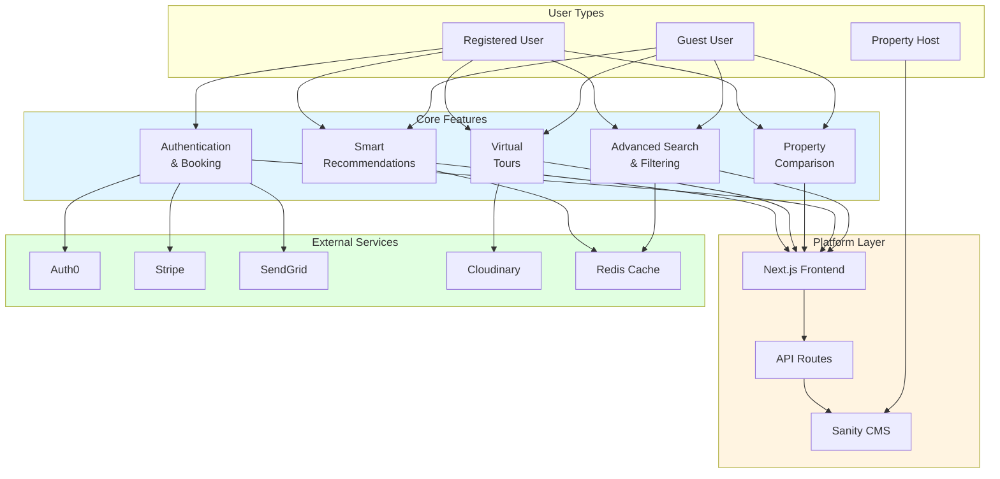

---

## Implementation Timeline

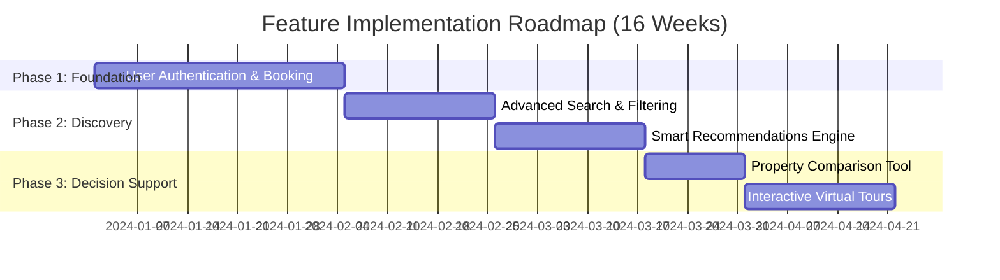

---

## Feature Complexity & Priority Matrix

```mermaid
quadrantChart
    title Feature Prioritization Matrix
    x-axis Low Complexity --> High Complexity
    y-axis Low Priority --> High Priority
    quadrant-1 Quick Wins
    quadrant-2 Strategic
    quadrant-3 Fill-ins
    quadrant-4 Major Projects
    Property Comparison: [0.3, 0.6]
    Advanced Search: [0.5, 0.9]
    Recommendations: [0.6, 0.9]
    Virtual Tours: [0.6, 0.5]
    Auth & Booking: [0.8, 1.0]
```

---

## Story Points Distribution

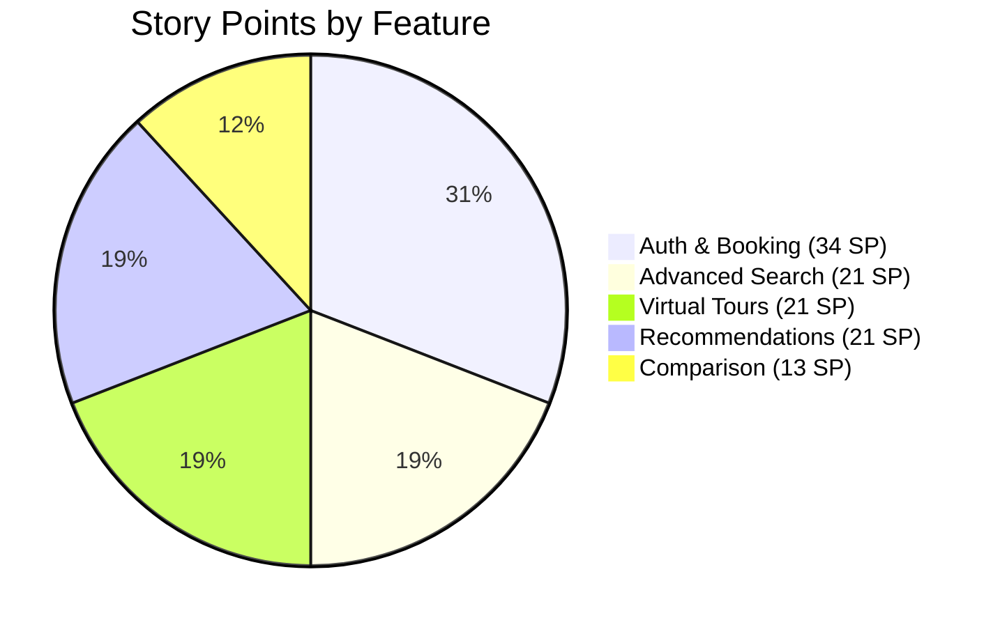

---

## User Journey Flow

```mermaid
flowchart LR
    A[Land on Homepage] --> B{Logged In?}
    
    B -->|No| C[See Popular Properties<br/>+ Trending]
    B -->|Yes| D[See Personalized<br/>Recommendations]
    
    C --> E[Use Search & Filters]
    D --> E
    
    E --> F[Browse Results]
    F --> G[View Property Details]
    
    G --> H[Explore Virtual Tour]
    G --> I[Add to Comparison]
    
    I --> J[Compare Properties]
    J --> K{Decide}
    
    H --> K
    
    K -->|Not Sure| F
    K -->|Ready| L[Start Booking]
    
    L --> M{Logged In?}
    M -->|No| N[Register/Login]
    M -->|Yes| O[Select Dates & Guests]
    
    N --> O
    O --> P[Enter Guest Details]
    P --> Q[Payment]
    Q --> R[Confirmation]
    
    style D fill:#e1f5ff
    style H fill:#fff4e1
    style J fill:#f0e1ff
    style R fill:#e1ffe1
```

---

## Data Flow Architecture

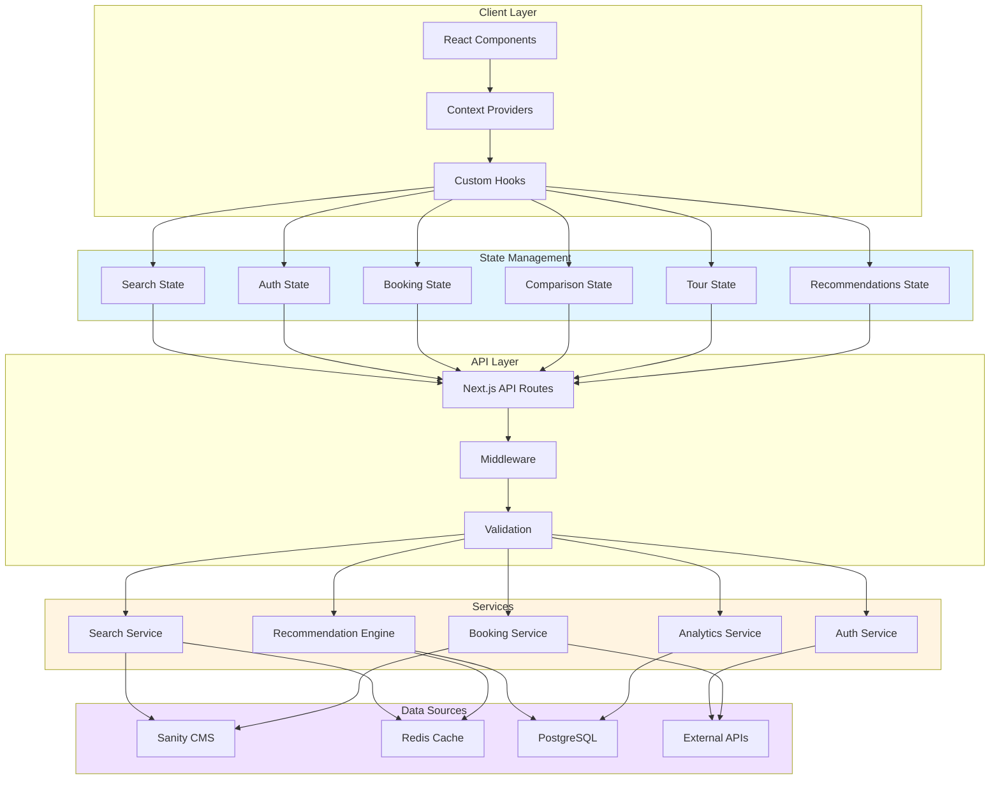

---

## Feature Dependencies

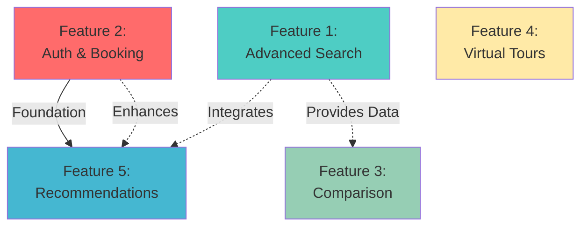

**Legend:**
- Solid arrows: Critical dependencies
- Dashed arrows: Optional enhancements
- Red: Critical priority
- Blue/Teal: High priority
- Green/Yellow: Medium priority

---

## Technology Stack Overview

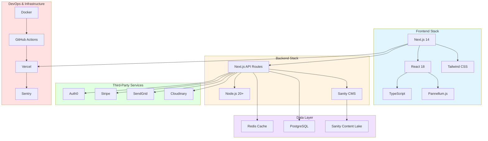

---

## Cost Breakdown by Phase

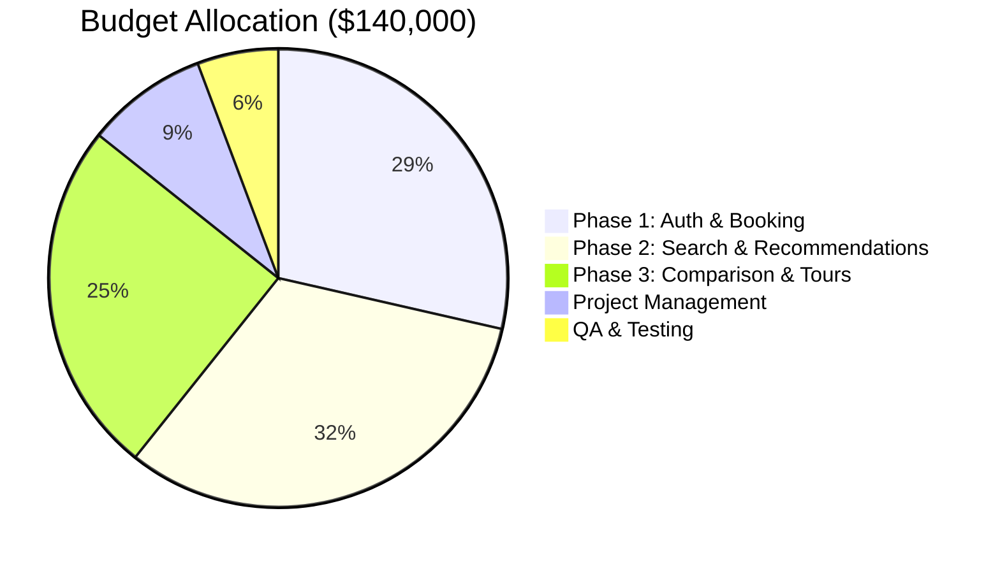

---

## Team Velocity & Capacity

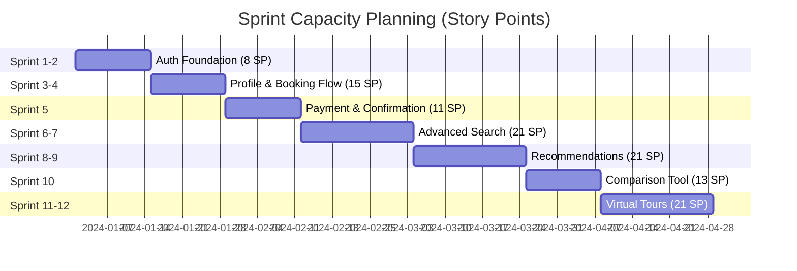

---

## Success Metrics Dashboard

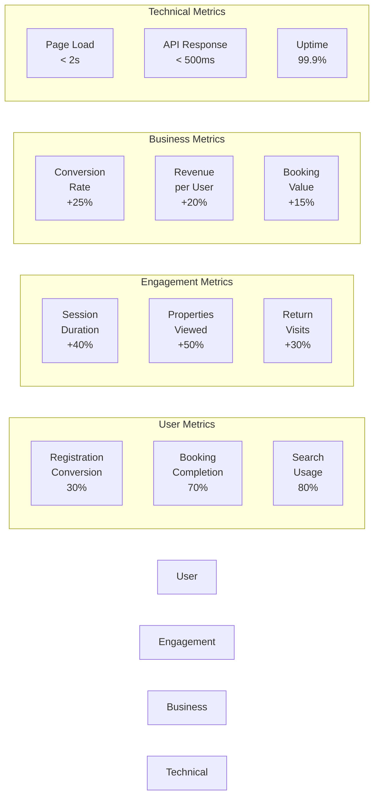

---

## Risk Heat Map

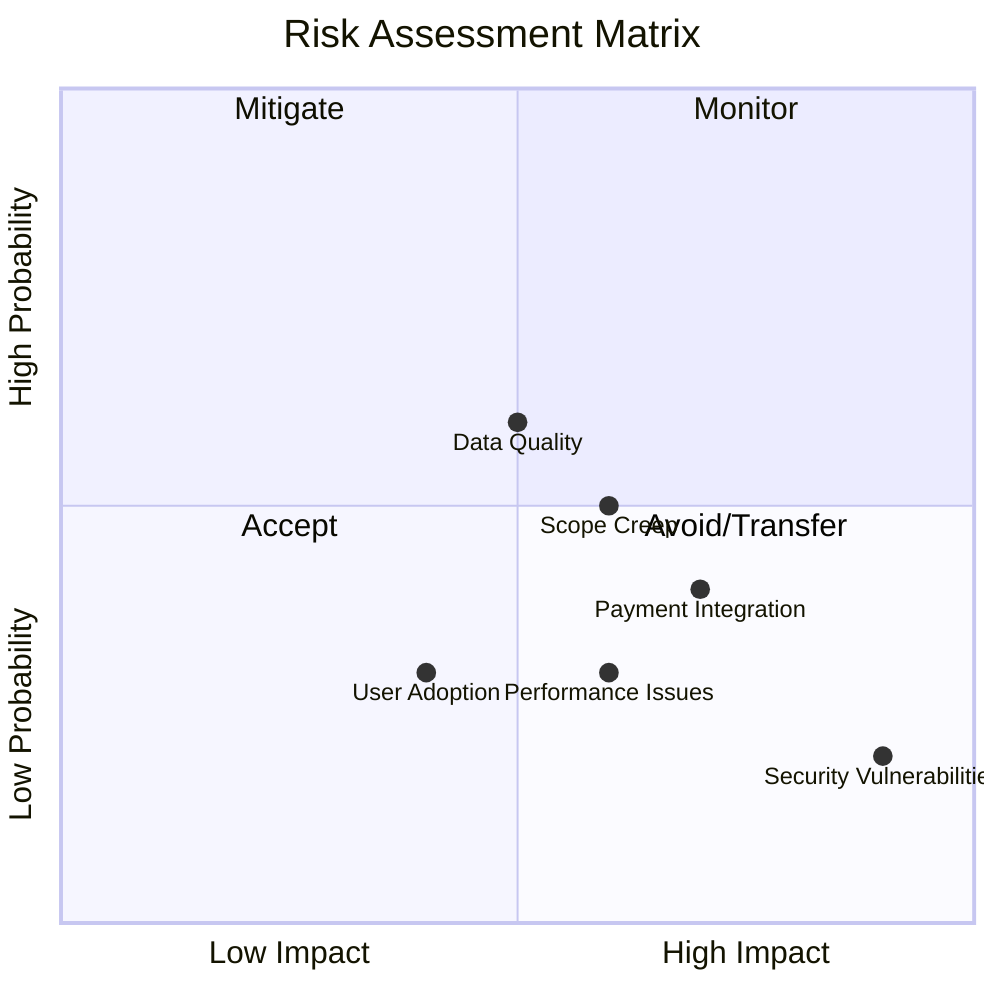

---

## Feature Rollout Strategy

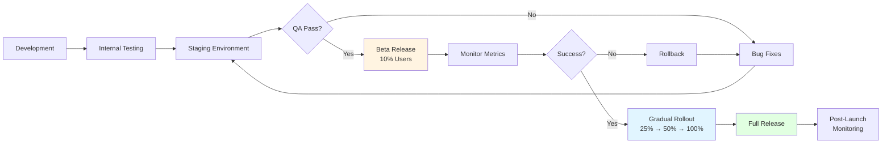

---

## Integration Points

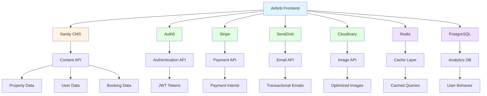

---

## Monitoring & Alerting Flow

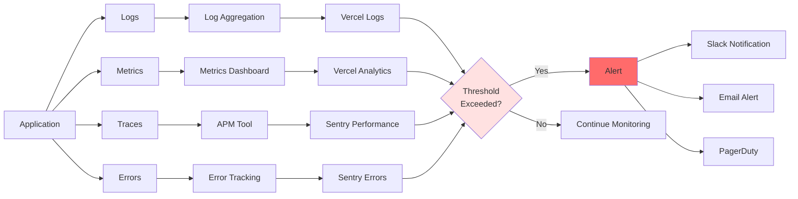

---

## Summary Statistics

### Development Effort
- **Total Story Points:** 110 SP
- **Total User Stories:** 36
- **Average Story Size:** 3.1 SP
- **Largest Story:** Payment Processing (8 SP)
- **Smallest Story:** Comparison Actions (1 SP)

### Timeline
- **Shortest Feature:** Property Comparison (2 weeks)
- **Longest Feature:** Auth & Booking (5 weeks)
- **Total Duration:** 16 weeks
- **Number of Sprints:** 8 (2-week sprints)

### Resources
- **Frontend Developers:** 2
- **Backend Developer:** 1
- **UI/UX Designer:** 0.5 (part-time)
- **QA Engineer:** 0.5 (part-time)
- **Total Team Size:** 4 FTE

### Budget
- **Minimum Estimate:** $113,000
- **Realistic Estimate:** $140,000
- **Maximum Estimate:** $171,000
- **Contingency Buffer:** 15%

### Expected ROI
- **Conversion Rate Increase:** +25%
- **User Engagement Increase:** +35%
- **Revenue per User Increase:** +20%
- **Payback Period:** 6-9 months

---

## Next Steps

1. **Week 1:** Stakeholder review and approval
2. **Week 2:** UI/UX design phase for all features
3. **Week 3:** Technical planning and architecture finalization
4. **Week 4:** Begin Phase 1 development (Auth & Booking)
5. **Ongoing:** Weekly sprint reviews and retrospectives

---

**Document Version:** 1.0  
**Last Updated:** 2024-01-XX  
**Status:** Proposal - Awaiting Approval
